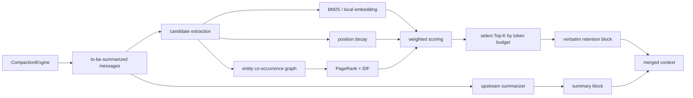

<p align="center">
  
</p>

# PilotDeck-Hippo: Selective Memory for Long-Context Compaction

> **PilotDeck 创造计划 · Direction 3 (Harness / Memory / Architecture Optimization)**

> **Navigation:** [中文](README.md) · English · **Live demo:** <https://qgeng1465.github.io/pilotdeck-hippo/>

**What this is.** A switchable "verbatim retention block" added to upstream PilotDeck's context-compaction engine: before compaction each message about to be summarized is scored, a fixed token budget picks the few highest-scoring ones, and their **verbatim** text goes back into the post-compaction context alongside the summary, so early precise facts (gene names, frequency numbers, file paths, checkpoints) can still be reproduced word-for-word afterwards. The change lives in `src/context/compaction/`; at the **engine layer** omitting `scorePolicy` takes the upstream path with byte-identical output, and at the **app layer** this fork enables it by default — `agent.compaction.retention: off` switches back with one line.

**Results.** On 10 seeds that never took part in tuning, verbatim retention of the 20 injected facts goes from 0 to **17.9/20** (EN N=160) and **10.0/20** (ZH N=160), with the two N=80 cells at 9.4 / 6.0 — 10 wins / 0 ties / 0 losses in all four cells (sign test p=0.002); the cost is **1.11–1.20×** more post-compaction tokens. With a real summarizer (DeepSeek-V4-Flash) the advantage becomes a conditional: no measurable difference under a generous summary budget, current-topic answers **10/16 → 16/16** under a tight one ([§4.7](#47-topic-switching-under-a-real-summarizer-a-supplement-to-the-first-boundary-of-46)). Fastest reproduction: `corepack pnpm install --frozen-lockfile`, then `corepack pnpm benchmark:demo` (~2 s; EN N=160: upstream 0/20 → Hippo 18/20).

Navigation: [Core Idea](#core-idea) · [1-Minute Overview](#judges-1-minute-overview) · [What It Does (real data)](#what-it-solves-with-real-data) · [Benchmarks & Results](#4-benchmark-approaches-and-results) · [Quick Start](#3-quick-start-from-source) · [Known Limits](#5-compatibility-tests-and-known-limits) · [Upstream Bug Fixes](#51-three-upstream-bugs-fixed-along-the-way) · [Sources & repo hygiene](#6-sources-and-repository-hygiene) · [Demo & verification](#7-demo-and-verification-entry-points) · [License](#license)

## Core Idea

Context compaction is lossy. When the context is tight, the upstream `CompactionEngine` keeps the most recent span (the tail) **verbatim** and **summarizes** the older history into a paragraph. A summary preserves the gist, but it tends to drop low-frequency precise facts — gene names, frequency numbers, file paths, checkpoints, decision records — exactly the things an agent must reproduce verbatim later.

Hippo does not set out to be "a better summarizer". That would only raise the ceiling within a lossy framework, and cost more. Hippo changes the mechanism instead: **some content never enters the lossy path at all.**

Before compaction, each message that is about to be summarized is scored, and a **fixed, capped** token budget picks the highest-scoring ones, whose **verbatim** text enters the post-compaction context alongside the summary:

```text
S(m) = 0.85 × sim(q, m)          # semantic relevance to the pending request (BM25; optional local embedding)
     + 0.15 × position_decay(m)  # the closer to the present, the more likely relevant
     + 0.00 × idf_pagerank(m)    # entity co-occurrence graph coreness; default weight 0, see §4.2
```

Three design constraints — and the difference from "tuning the summarizer prompt once more":

- **The budget is hard**: the retention block budget = 20% of the tail budget, at least 256 tokens, hard-capped. The post-compaction context stays manageable; it cannot blow up because we "want to remember more".
- **Output is verbatim, not paraphrase**: retained messages enter the context word-for-word, unaffected by summarizer-model variance.
- **Fail fast and step back**: a scoring error, a missing model, or an embedding-load timeout all fall back to the pure upstream summary path and never block the conversation.

## What It Solves (with real data)

**In one sentence**: at roughly the same ~1.1–1.2× post-compaction tokens, turn "verbatim usable precise facts" in the post-compaction context from 0 into 6–18 (the four benchmark cells, table below).

Every number in the table below comes from `benchmarks/results/*.json`, re-run on seeds that **never took part in any tuning (20260921–20260930, n=10)** — not the best score on seen seeds. The metric is how many of 20 injected facts still appear **verbatim** (not paraphrased) in the post-compaction context:

| Scenario | Upstream (no retention) | Hippo (current default) | Hippo wins/ties/losses over 10 seeds |
|---|---:|---:|---|
| EN N=160 | 0 / 20 | **17.9 / 20** | 10 / 0 / 0 (sign test p=0.002) |
| ZH N=160 | 0 / 20 | **10.0 / 20** | 10 / 0 / 0 (p=0.002) |
| EN N=80 | 0 / 20 | **9.4 / 20** | 10 / 0 / 0 (p=0.002) |
| ZH N=80 | 0 / 20 | **6.0 / 20** | 10 / 0 / 0 (p=0.002) |

Upstream's 0 comes from "lossy summary + a fake summarizer that never emits FACT text" — a **structural contrast** (lossy vs verbatim), not the ceiling of a real summarizer. The real-LLM contrast is in [§4.3](#43-real-llm-closed-loop-two-rounds-with-sensitivity) (2 seeds/cell, its own seeds — a different set from the table above; the two sets of numbers are not mixed). In the real-LLM loop, Hippo wins 4/4 cells across both rounds on Chinese.

**We also measured "is it accurate", not just recall**: beyond how many of the 20 facts came back, we computed **precision** per message from the engine's own retained block — the block is almost entirely facts the query needs, with few unrelated messages mixed in (EN/ZH × N=40/80/160, precision **89–100%**, 2.7–11× over a random baseline; recall is bounded by the retention budget, and the cost is written in the same table). A judge who asks only about recall would miss the failure mode where a policy sweeps in the entire history; precision answers that. See [§4.1a](#41a-extraction-precision-per-message-precisionrecall-the-direct-answer-to-how-do-you-guarantee-accurate-extraction).

**What it means for you (a real user)**: after a long task runs for dozens of turns, when you ask "what was the TP53 frequency earlier", the agent shouldn't have to say "according to the earlier summary, roughly…". Hippo lets that question still return the exact original number.

## Judges: 1-Minute Overview

| Item | Content |
|---|---|
| Pain point | Lossy summary drops early precise facts in long conversations; the agent can't answer alike queries reliably later. |
| Change | Add an optional `scorePolicy` to `CompactionEngine` that selectively retains top-scoring messages from the to-be-summarized set. **Engine layer** default = upstream path (byte-identical, guarded by golden fixture); **App layer** this fork enables it by default, `agent.compaction.retention: off` turns it back to upstream with one switch. |
| Method | `S(m) = 0.85·semantic + 0.15·position decay + 0.00·IDF-corrected entity-graph PageRank`, selecting by token budget. The rank term resting at 0 is a hold-out conclusion; reasons and trade-offs in [4.2](#42-component-ablation). |
| Current headline | Structural benchmark N=160: fact retention 0/20 → 17.9/20 (**10 wins / 0 ties / 0 losses on the 10 seeds never used in tuning, sign test p=0.002**, reproducible from the committed JSON); **extraction precision (per message) 89–100%, 2.7–11× over random** ([4.1a](#41a-extraction-precision-per-message-precisionrecall-the-direct-answer-to-how-do-you-guarantee-accurate-extraction)). Real-LLM closed loop ran under two conditions (endpoint × summary budget): **Chinese wins consistently across both rounds** (N=160: 56.3% vs 31.3%; tight-budget round 81.3% vs 0%); English varies with summary budget — full tables and sensitivity in [4.3](#43-real-llm-closed-loop-two-rounds-with-sensitivity); conclusions are governed by `benchmarks/results/*.json`. |
| Upstream bugs fixed along the way | Three pre-existing defects unrelated to this change that a real user does hit, each with a test that **must fail before the fix**: ① three `unref()`'d timeout timers leave an `await`ed promise never settling (`fetch.ts` / `BackgroundTaskRuntime.wait()` / streaming idle timeout); ② `countTokens` degrades to O(n²) on long repeated runs — 8,000 chars **8,999 ms → 9.1 ms (993×)**, and `read_file` on a 300-line tool result **79.2 s → 1.2 s**; ③ startup recovery's "newest transaction" ordering key mixed in file mtime (1 ms granularity locally), so it occasionally picked the wrong transaction. See [5.1](#51-three-upstream-bugs-fixed-along-the-way). |
| Live path | Open Web UI (`pnpm dev`; vite client default http://localhost:5173; 3001/5173 slide automatically when occupied — trust the `[dev-launcher]` log; in this fork `agent.compaction.retention` defaults to `hippo`, enabled) → create a long conversation → trigger Compaction → **the compaction divider shows a retention badge** (e.g. "Hippo retained 3 messages verbatim (1,204 tok)", hover shows the policy and this round's budget) → re-ask the original question; or simply `pnpm benchmark:demo`. ~3–5 min. |
| Known boundaries (we draw them ourselves) | ① The benefit is "fidelity to the **current task**", **not** "remembering abandoned old topics" — the old-topic advantage is, on diagnosis, an artifact of template-sharing in the harness, [4.6](#46-topic-switching-how-much-of-an-old-topic-survives); ② with a **real summarizer** this becomes conditional: with a generous summary budget no difference is measurable (same-config repeats already swing 3–4 questions), only under a **tight budget** is it measurable (current topic 10/16 → 16/16, zero swing), [4.7](#47-topic-switching-under-a-real-summarizer-a-supplement-to-the-first-boundary-of-46); ③ changing the default weights is justified by "align tuning argmax + one fewer term", **not** "weight tuning improved scores" (that comparison is not significant on the holdout set, [4.5](#45-holdout-validation-seeds-used-for-parameter-selection-are-never-used)). |

## 1. Problem and Design Trade-offs

The upstream strategy is "keep the recent tail, summarize the rest". It is adequate for short conversations, but as context pressure rises it drops precise facts that are not in the tail. Hippo only adds a switchable retention block: the summarizer still does the compression, and the retention block brings a few high-value verbatim messages back into context.

We chose locally computable features to avoid calling another LLM on every compaction:

- **Semantic relevance**: in `sim(q, m)`, `q` is the single most recent real user request in the tail. Default BM25 (with built-in IDF); set `PILOTDECK_BGE_MODEL` to switch to a local embedding cosine (`Xenova/bge-small-zh-v1.5`, runs offline, within the event's on-device model quota).
- **Position decay**: there is no reliable per-message timestamp, so decay is computed from position; it is a positional heuristic, not a true Ebbinghaus curve in real time.
- **Entity-graph coreness**: extract entities from messages, build a co-occurrence graph, run PageRank, then multiply by an IDF factor `log(1 + M / df)` to down-weight hub words that repeat across most messages. Bilingual extraction: ASCII extracts CamelCase tokens; Chinese uses a sliding-bigram, no-tokenizer extraction plus high-frequency function-word document-frequency pruning.
- **Budget constraint**: retention budget = `tailTokenBudget × 0.2`, at least 256 tokens; over-budget overflows are cut by a deterministic tie-break.

The default score (weight constants `EBBINGHAUS_DEFAULT_WEIGHTS`, re-anchored by ablation + grid search and re-checked on **unseen** seeds, see [4.2](#42-component-ablation)):

```text
S(m) = 0.85 × sim(q, m)
     + 0.15 × position_decay(m)
     + 0.00 × idf_pagerank(m)     # weight 0; the term stays in the formula and configurable
```

The third term's default weight is **0**: the grid search optimum is `0.85/0.15/0.00`, and on the hold-out set the rank term is **7 wins / 33 ties / 0 losses** in one-to-one comparison, **no cell significant** (p = 1 / 0.5 / 1 / 0.125) — dropping it costs nothing, but it also gains nothing measurable, so it takes zero weight while the code and the `wRank` config option remain, ready to enable for other distributions. These weights are a tuning result on the current synthetic protocol and cannot be taken as a global optimum for every real task; **we do not claim "weight tuning improved scores"** — the reason to change the default is aligning with the tuning argmax and having one fewer term (three → two). The real main effect is "verbatim retention vs no retention" (§4.5).

When there is no query, `sim` degenerates to the constant `0.5` and contributes nothing to ranking; under the default weights `wRank` is likewise 0, so ranking is **determined by recency alone** — which is exactly why the no-query scenario sits near the floor on every metric. So the CompactionEngine now **avoids entering that scenario** rather than weighting `rank` as a safety net: when the tail yields no user request, it falls back to the most recent real user request in the whole conversation (§4.2, item 4).

## 2. Architecture and Data Flow



Core interface (matches the code):

```ts
const engine = new CompactionEngine({
  model, // your summarizer model adapter
  scorePolicy: buildEbbinghausPageRankPolicy({
    wSim: 0.85, wTime: 0.15, wRank: 0, // this is the default; wRank>0 re-enables the entity-graph term
  }),
});
const result = await engine.run({ trigger: "auto", messages, keepTailRatio: 0.18 });
```

Omitting `scorePolicy` uses the upstream path. On the app side this config parses into the same policy with no code change:

```ts
// src/context/compaction/retention/EbbinghausPageRankPolicy.ts
resolveRetentionScorePolicy({ retention: "hippo" }) // → EbbinghausPageRankPolicy
resolveRetentionScorePolicy({ retention: "off" })   // → undefined (pure upstream)
```

Suggested files to look at during review:

- `src/context/compaction/CompactionEngine.ts`: the switch, candidates, retention block, and merge order.
- `src/context/compaction/retention/RetentionTypes.ts`: policy and scoring types.
- `src/context/compaction/retention/MessageText.ts`: uniform message textification.
- `src/context/compaction/retention/LocalEmbedding.ts`: local embedding and BM25 fallback.
- `src/context/compaction/retention/EntityGraph.ts`: bilingual entity extraction, DF pruning, IDF-PageRank.
- `src/context/compaction/retention/EbbinghausScore.ts`, `EbbinghausPageRankPolicy.ts`: scoring and budget selection.
- `tests/context/hippo-retention.spec.ts`: dedicated unit tests.
- `benchmarks/`: A/B, ablation, tuning and real-LLM evaluation scripts.

## 3. Quick Start (from source)

Environment: Node.js `22.13+ <23`, Python 3, `make`, a C/C++ toolchain, `ripgrep`. (Desktop installers and other install paths: [Appendix A](#appendix-a-the-upstream-pilotdeck-project).)

```bash
corepack enable
corepack pnpm install --frozen-lockfile
node scripts/bootstrap-pilotdeck-config.mjs   # generates ~/.pilotdeck/pilotdeck.yaml
```

Configure a model in `~/.pilotdeck/pilotdeck.yaml` or in the Web UI. Never commit a real API key (see `.env.example` for the env-var template):

```yaml
schemaVersion: 1
agent:
  model: custom/<model-id>
  compaction:
    retention: hippo   # this fork defaults to hippo; set off to restore pure upstream compaction
model:
  providers:
    custom:
      protocol: openai
      url: https://<endpoint>/v1
      apiKey: ${PILOTDECK_API_KEY}
```

Start the Web UI:

```bash
cd ui && npm run start       # production (runs vite build first), default http://localhost:3001
# dev mode: npm run dev      # default http://localhost:5173
```

To verify Hippo alone:

```bash
corepack pnpm benchmark:no-regression   # with scorePolicy off it must equal the upstream baseline
corepack pnpm benchmark:smoke           # small smoke
corepack pnpm benchmark                 # full A/B (N=40/80/160 × K=10)
corepack pnpm benchmark:demo            # big-screen demo
corepack pnpm benchmark:tokenizer       # time/speedup table of the two tokenizer impls (§5.1 bug 2)
corepack pnpm benchmark:extraction      # per-message precision/recall — answers "how do you guarantee accurate extraction" (§4.1a)
```

Real-LLM evaluation needs network. Endpoint resolution order: ① `PILOTDECK_EVAL_URL` + `PILOTDECK_EVAL_KEY` → ② repo-root `poliet_deck.txt` (an optional self-hosted gateway key; the secret is not committed) → ③ `~/deepseek_key.txt` (official API). The generated JSON records the endpoint source, model version, and a three-way token ledger (summary prompt / summary completion / judge prompt):

```bash
corepack pnpm benchmark:real-llm                # §4.3 single-topic closed loop
corepack pnpm benchmark:real-llm-topic-switch   # §4.7 topic-switch closed loop (includes within-repeat variance; set PILOTDECK_EVAL_REPEATS)
```

## 4. Benchmark Approaches and Results

### 4.1 Structural stress test (fake summarizer)

Synthetic bioinformatics dialogues scatter 20 precise facts across the first ~75% of messages; the tail asks for verbatim reproduction. The fake summarizer never emits FACT text, so upstream 0/20 is a *structural* contrast ("lossy summary vs verbatim retention"), not a ceiling on what a real summarizer can do. The table below is the **median** produced by `pnpm benchmark` (seed=20260911), from `benchmarks/results/2026-09-11T11-16-22-522Z.json`:

| N | Pre-compaction tokens | Upstream post | Hippo post | Fact retention /20 (upstream → Hippo) |
|---:|---:|---:|---:|---:|
| 40 | 3,906 | 1,153 | 1,381 | 0 → 8 |
| 80 | 8,291 | 2,368 | 2,634 | 0 → 9 |
| 160 | 17,034 | 4,739 | 5,339 | 0 → 18 |

I.e. Hippo trades ~1.11–1.20× post-compaction tokens for verbatim facts; every run is deterministic (`true`). **The cost is stated plainly**: this 11–20% is extra, not saved — Hippo buys "facts still reproducibly verbatim after compaction", not "compresses harder".

### 4.1a Extraction precision (per-message precision/recall): the direct answer to "how do you guarantee accurate extraction"

The `0/20→8/9/18` above is **recall** — how many of the 20 facts the query must reproduce survive; it does not say whether the retention block is mostly the right messages. This section measures precision/recall at message granularity from the engine's own `retention.retainedMessageTexts` (the messages scoring selected and actually entering the post-compaction context, **not reconstructed from the fingerprint — no reconstruction artifacts**), on held-out seeds (2026-09-21+) via `pnpm benchmark:extraction` (JSON: `benchmarks/results/extraction-precision-2026-09-11T13-39-26-139Z.json`):

| lang | N | Recall (fraction kept) | Precision (relevant share of retained block) | Random baseline | Lift over random |
|---|---:|---:|---:|---:|---:|
| en | 40 | 6/20 | **100%** | 36% | 2.8× |
| en | 80 | 7/20 | **100%** | 18% | 5.7× |
| en | 160 | 16/20 | **100%** | 9% | 11× |
| zh | 40 | 4/20 | **100%** | 37% | 2.7× |
| zh | 80 | 4/20 | **100%** | 18% | 5.6× |
| zh | 160 | 8/20 | **89%** | 9% | 10× |

(Recall differs slightly from §4.1: that is the seed-20260911 tuning protocol; this is held-out seeds, counted by "messages" rather than "markers"; both are within-budget recall.)

1. **High precision = the scoring really separates signal from noise**: the retained block is almost entirely fact messages the current query needs (only zh N=160 sneaks in one noise message), 2.7–11× over random — it is not dumping the whole history back in.
2. **Recall is bounded by the token budget**: the retention budget (≤256 tok, actually using 88–99%) only fits 4–16 messages. **The cost is explicit**: keep the most relevant, can't hold everything — the same trade-off as the main benchmark's "pay tokens for fidelity" (1.11–1.20×).
3. **What it guarantees**: this does not guarantee correct selection on arbitrary real tasks — the scorer is still an unsupervised heuristic. What it *does* guarantee are the two measurable things — **once selected, almost necessarily relevant (precision) and verbatim-lossless (per §4.1); the costs and boundaries are written in the table**.

### 4.2 Component ablation

Splitting the same formula apart, re-run on identical transcripts (protocol: EN+ZH, N=40/80/160, 10 seeds; medians. From `benchmarks/results/ablation-2026-09-11T11-17-30-040Z.json`):

| Variant | EN N=160 | EN N=80 | ZH N=160 | ZH N=80 |
|---|---:|---:|---:|---:|
| sim only | 16 | 7 | 8 | 4 |
| time only | 2 | 2 | 2 | 2 |
| rank only (raw PageRank) | 0 | 0 | 0 | 0 |
| rank only (+IDF) | 0 | 0 | 1.5 | 1 |
| full (old default 0.4/0.35/0.25) | 10.5 | 6.5 | 6 | 5 |
| **full (current default 0.85/0.15/0.00)** | **18** | **9** | **10** | **6** |

(Medians under the tuning protocol. The `0.7/0.15/0.15` variant is not listed here — its difference from the current default is tested by a *hold-out* paired comparison, §4.5 row 4 and item 3 below; the two protocols' numbers are not mixed.)

Ablation surfaced and fixed three problems on the spot:

1. **Hub dilution**: the hubs of raw PageRank are repeated noise (QC, Step, and other tokens appearing in every message); the fact messages' unique entities score low — rank alone scores 0. After IDF correction the Chinese rank term recovers signal (ZH N=40: 0 → 3.5).
2. **Weight mismatch**: the old default let time/rank dilute the main `sim` term. `pnpm benchmark:tune` re-anchored over an 18-config grid (N=80 × 3 seeds × 2 langs); the current default **ranks first at 72/120**, and is first in all 6 `(lang × N)` cells. (The §4.2 table lists only 4 cells for layout; the full 6 including N=40 are in the ablation JSON.)
3. **The default was not the optimum** (found by the hold-out re-check): the grid's **argmax is `0.85/0.15/0.00` (72/120), but the code constant at the time was `0.7/0.15/0.15` (68/120)** — the default deviated from the tuning result itself. On never-tuned seeds 20260921–20260930, one-to-one paired comparison (§4.5), the rank term is **7 wins / 33 ties / 0 losses, no cell significant** (p = 1 / 0.5 / 1 / 0.125).

   **How it was fixed**: set `EBBINGHAUS_DEFAULT_WEIGHTS` to `{0.85, 0.15, 0}`, aligned with the tuning argmax; the rank term is **not deleted**, its weight just goes to 0, and the formula, entity-graph code and the `wRank` config all remain, re-enable with one line of config. Plus a mechanical guard: in `holdout.ts` the "current default" row reads the `EBBINGHAUS_DEFAULT_WEIGHTS` constant directly instead of a copied literal, so **any future default drift shows up directly in the hold-out table**.

   **Honest boundary**: we changed weights but **do not claim an improvement**. rank's 0 losses on holdout only say "dropping it costs nothing"; 7-33 means the effect is far smaller than the noise — the real justification is that it aligns with the tuning argmax and is simpler (three terms → two), not that it scores more. The contrast vs upstream (no retention) — 17.9 / 9.4 / 10.0 / 6.0 — is this work's main effect: all four cells 10 wins 0 ties 0 losses, p=0.002.

4. **Retention degenerates without a query** (newly found and fixed this round): compaction isn't always triggered by a new user request — one very long tool output blowing the budget triggers it too. Then there is no user message in the tail window, `queryHint` degenerates to an empty string, and the similarity term goes to zero: the hold-out no-query probe shows the current default keeps only **0.00–0.20 / 20** facts, while pure `sim` can keep 1–2. This is not a weighting problem — putting the rank weight back doesn't rescue the main path (see above).

   **How it was fixed**: fix the cause, not the weight. `CompactionEngine` now, when the tail yields no real user request, falls back to the **most recent real user request in the whole conversation** (still the request that the compacted messages serve), rather than an empty string. The regression test `tests/context/hippo-retention.spec.ts` "retention is still query-conditioned when the tail holds no user request" fails deterministically when the fix is reverted (the policy receives `""` in practice) and passes with it. Incidentally this reveals where the rank term genuinely has signal: precisely in the no-query regime (Chinese no-query probe: rank+IDF 2.8/20 vs sim-only 1.0/20; English 0–0.5/20) — but that regime is now eliminated at the engine level.

### 4.3 Real-LLM closed loop (two rounds, with sensitivity)

Summarizer and judge are both DeepSeek-V4-Flash (temperature 0); each cell = 2 seeds, 16 questions total. A model that both summarizes and judges introduces model bias; the numbers below are a reproducible experimental record, not a substitute for independent judgment or human spot-checks. On the same day we ran one round on each of two endpoints; **the fact that results differ is itself evidence that single-round real-LLM numbers are not extrapolable**; both JSONs are committed (`benchmarks/results/real-llm-*.json`, including endpoint source and token spend). Both rounds share the same code and the same summary output cap of **4,000 tok/call** (`benchmarks/realLlmEval.ts`). Two honest notes: Round A's JSON has **no `endpoint` field** (the script didn't write it at the time), and **neither JSON has `finish_reason`** — the script had *computed* `summaryTruncated` but only `console.log`'d it, never persisted it; this round we fixed it to persist both, along with each cell/call's completion count, so next round the cap is directly measurable.

Round A — official API. All 8/8 cells record completion of exactly **2,400 = 2 calls × 1,200** (`en/zh × N=80/160 × upstream/Hippo` all identical). Complete constancy across all 8 cells is a **cap signature**, not model choice; but the A-round cap value actually in effect cannot be found in the repo (that round didn't record it; the code value is 4,000), so "the summary was truncated" **remains inference, not measurement**:

| lang | N | Upstream | Hippo |
|---|---:|---|---|
| en | 80 | 68.8% (11/16), 2,904 tok | 68.8% (11/16), 3,081 tok |
| en | 160 | 12.5% (2/16), 4,977 tok | **87.5% (14/16)**, 5,769 tok |
| zh | 80 | 0% (0/16), 2,340 tok | 18.8% (3/16), 2,319 tok |
| zh | 160 | 0% (0/16), 4,002 tok | **81.3% (13/16)**, 4,964 tok |

Round B — a self-hosted gateway endpoint, summary cap 4,000 tok/call, **16 summary calls per round** (8 cells × 2 seeds). This time the cap is directly readable from the JSON: the `zh/80 upstream` cell is exactly 8,000 = 2 × 4,000 — both calls capped; the other 7 cells total 5,266–7,335, all > 4,000, so **at least 8 of 16 calls hit the cap**:

| lang | N | Upstream | Hippo |
|---|---:|---|---|
| en | 80 | 100% (16/16), 3,402 tok | 100% (16/16), 3,704 tok |
| en | 160 | 100% (16/16), 5,955 tok | 100% (16/16), 6,278 tok |
| zh | 80 | 0% (0/16), 2,075 tok | **62.5% (10/16)**, 2,958 tok |
| zh | 160 | 31.3% (5/16), 4,586 tok | **56.3% (9/16)**, 4,912 tok |

Three readings across both rounds:

1. **On Chinese, Hippo wins consistently across both rounds (4/4 cells)**. When v4-flash writes a Chinese summary it doesn't reproduce numeric facts verbatim (upstream post-compaction FACT markers 0/20); Hippo's retention block brings the verbatim text back into context.
2. **On English, the result varies with summary length**. Round A's summaries were short (1,200 tok/call, constant across 8/8 cells) and upstream N=160 was only 12.5%; in Round B — summaries more than twice as long (≥2,633 tok/call) — upstream returns to 100%, and post-compaction tokens rise (en N=160: 4,977 → 5,955). **Length and score moving together is measured; the causal explanation remains inference**: the most natural one is that A-round summaries were truncated and, with more room in B, upstream recovered by "copying checkpoints into a longer summary". But A's actual cap value can't be found in the repo, so we don't write it as a conclusion here. What we can confirm is the direction of cost — upstream must pay for longer summaries to hold precise facts; Hippo reaches the same goal with a budget-capped verbatim retention block.
3. **Variance statement**: only 16 questions/cell, 2 seeds, same-model judge, and the two endpoints (official API vs self-hosted gateway) may differ in service characteristics. So we only state directional conclusions (Chinese stable win; English varies with summary budget), and do not claim a single "improved X points".

### 4.4 Scoring latency (efficiency cost)

Policy scoring is local computation, median latency: EN ≈ 13–50 ms, ZH ≈ 135–369 ms (measured extremes of `wallMsMedian` in the ablation JSON, N=40→160; Chinese bigram entity counts run ~5–10× English, so a bigger graph). Compared with one real LLM summary call (seconds), scoring overhead is ≈5–15%, and compaction is a low-frequency event. Optimization paths (per-message entity truncation, fewer PageRank iterations) are already parameterized. Measure: `pnpm benchmark:ablation` (wall ms column); machine specifics in the result JSON.

### 4.5 Holdout validation (seeds used for parameter selection are never used)

The §4.2 tables pick weights on a seed batch and then report scores on that same batch — that only shows "fits well", nothing else. This section separates the two concerns:

- **Protocol**: `SEEN_SEED_MAX = 20260920`, `HOLDOUT_SEED_BASE = 20260921`. Tuning/ablation uses only seeds ≤ 20260920; the holdout set always takes seeds 20260921–20260930 (10 seeds), **never used in any selection** (weights, IDF switch, PageRank iteration count included).
- **Statistics**: each seed is paired with itself (same seed, same transcript, only the strategy changes); we report per-seed deltas, win/tie/loss and a **two-sided exact sign-test p**. With 10 seeds the smallest possible sign-test p is 0.002, so p=0.002 means "won all 10", not "huge effect size".
- **Verifiable**: `pnpm benchmark:holdout`; the table here is from `benchmarks/results/holdout-2026-09-11T11-19-13-567Z.json` (the directory keeps several earlier runs from the same day; this file is the one §4.5 cites).

Holdout table by variant (mean / 20 facts, 10 seeds):

| lang | N | Variant | Retained | sd | min | max | Post-compaction tokens |
|---|---:|---:|---:|---:|---:|---:|---:|
| en | 80 | upstream (no retention) | 0 | 0 | 0 | 0 | 2,362 |
| en | 80 | old default 0.4/0.35/0.25 | 6.6 | 1.35 | 5 | 9 | 2,641 |
| en | 80 | **current default 0.85/0.15/0.00** | **9.4** | 0.52 | 9 | 10 | 2,641 |
| en | 160 | upstream (no retention) | 0 | 0 | 0 | 0 | 4,753 |
| en | 160 | old default 0.4/0.35/0.25 | 10.8 | 0.63 | 10 | 12 | 5,349 |
| en | 160 | **current default 0.85/0.15/0.00** | **17.9** | 0.32 | 17 | 18 | 5,355 |
| zh | 80 | upstream (no retention) | 0 | 0 | 0 | 0 | 2,148 |
| zh | 80 | old default 0.4/0.35/0.25 | 5.1 | 0.57 | 4 | 6 | 2,394 |
| zh | 80 | **current default 0.85/0.15/0.00** | **6.0** | 0 | 6 | 6 | 2,392 |
| zh | 160 | upstream (no retention) | 0 | 0 | 0 | 0 | 4,088 |
| zh | 160 | old default 0.4/0.35/0.25 | 5.9 | 0.57 | 5 | 7 | 4,604 |
| zh | 160 | **current default 0.85/0.15/0.00** | **10.0** | 0 | 10 | 10 | 4,610 |

Paired comparisons (each seed as its own control):

| Comparison | en N=80 | en N=160 | zh N=80 | zh N=160 |
|---|---:|---:|---:|---:|
| current default vs upstream | +9.4 (10/0/0, p=.002) | +17.9 (10/0/0, p=.002) | +6.0 (10/0/0, p=.002) | +10.0 (10/0/0, p=.002) |
| old default vs upstream | +6.6 (10/0/0, p=.002) | +10.8 (10/0/0, p=.002) | +5.1 (10/0/0, p=.002) | +5.9 (10/0/0, p=.002) |
| current default vs old default | +2.8 (9/1/0, p=.004) | +7.1 (10/0/0, p=.002) | +0.9 (8/2/0, p=.008) | +4.1 (10/0/0, p=.002) |
| current vs previous default 0.7/0.15/0.15 | +0.1 (1/9/0, p=1) | +0.2 (2/8/0, p=.5) | 0 (0/10/0, p=1) | +0.5 (4/6/0, p=.125) |

**How to read — and how NOT to read — this table**:

- The main effect is **row one**: no retention → verbatim retention, 10 wins 0 ties 0 losses in all four cells. This is the claim we put out publicly.
- Row three (vs old default 0.4/0.35/0.25) is also solid, winning all four EN+ZH cells — the old default gave 0.25 to the rank term, letting rank dilute `sim`; that was the real weight mismatch.
- **Row four must be read as "no difference"**: 7 wins 33 ties 0 losses, p = 1 / 0.5 / 1 / 0.125, none significant. The legitimate reason to move the default weight to 0.85/0.15/0.00 is "align with the tuning argmax + one fewer term", **not** "it improved the score". Any claim that "weight tuning brought a significant improvement" contradicts this table.
- zh N=80 / zh N=160 have sd = 0 (all 10 seeds identical). This is not high precision; in the Chinese cells the retained messages concentrate on the same few typical facts. When reading Chinese numbers, look at the overall direction across the 10 seeds, not decimal-place differences.

### 4.6 Topic switching: how much of an old topic survives

The transcripts in earlier sections run "one topic all the way". Real use more often means **switching topics mid-way**: the first half is topic A, the tail starts asking about B, and at compaction only B's request is in hand. Then A-segment messages get **no query relevance for their own topic** — they can only compete for the leftover budget through residual similarity.

Protocol: 10 hold-out seeds, 10 facts per topic (20 total), A then B, and the pending request at compaction is B's. Script `pnpm benchmark:topic-switch`, table from `benchmarks/results/topic-switch-2026-09-11T11-48-15-802Z.json`; mechanism-diagnosis script `pnpm benchmark:topic-diagnosis`, from `benchmarks/results/topic-diagnosis-2026-09-11T11-44-03-797Z.json`.

**This table has two fact phrasings and must be read with both — citing only one half gives a wrong conclusion**:

| N | Fact phrasing | Variant | Topic A verbatim retained | Topic B verbatim retained | Post-compaction tokens |
|---:|---|---|---:|---:|---:|
| 80 | shared | upstream | 0 | 6 | 1,844 |
| 80 | shared | Hippo | 2 | **10** | 2,095 |
| 160 | shared | upstream | 0 | 6 | 3,451 |
| 160 | shared | Hippo | 5.9 | **10** | 3,889 |
| 80 | **decorrelated** | upstream | 0 | 6 | 1,798 |
| 80 | **decorrelated** | Hippo | **0** | **10** | 2,053 |
| 160 | **decorrelated** | upstream | 0 | 6 | 3,398 |
| 160 | **decorrelated** | Hippo | **0** | **10** | 3,827 |

`shared` = the original phrasing: both topics' facts share one field template (`cohort=… n=371 gene=… freq=… stat=…`) and the pending request reuses that vocabulary. `decorrelated` = each topic has its own field words and marker words, and the request only uses B's words, so **topic becomes the only factor distinguishing A from B facts**.

Three readings:

1. **The topic-A column (2 and 5.9 under `shared`) is a harness artifact that collapses to zero under `decorrelated`**. Diagnostic evidence: in single-term ablation `time only` and `rank only` are both **0/10**, `sim only` alone reproduces 5.0/10; surviving facts' mean position in the A segment is 0.58 (no "closer = more kept" tendency), further ruling out recency; and directly measuring BM25, A-facts against the B request score **0.820** while A-segment filler messages score **0.240**; rewriting the same facts as prose without the shared field labels drops them to **0.370** — i.e. (0.820 − 0.370) / (0.820 − 0.240) ≈ **78% of the similarity gap comes from the shared template** (using A-segment filler's 0.240 as the baseline in the denominator). Once this lexical bridge is removed, the A column is **0/10**, matching upstream. **So do not publicly say "Hippo remembered the old topic" — it does not.**
2. **The only conclusion that holds in both directions is in the B column: 6/10 → 10/10**. In the post-compaction context, *current*-topic precise facts are retained verbatim, while upstream under this stub summarizer only gets 6/10. This shares its origin with the §4.1 main effect: **the benefit is fidelity to the current task, not memory of old context.** (Tokens also drop slightly under `decorrelated`, since budget is no longer spent on the A segment.) **But this 6/10 has a stub-summarizer component**: in §4.7, with a real summarizer, upstream's current topic is also all correct, so read the B column as a structural contrast "verbatim retention block vs stub summary", not as "how many more questions the user can answer".
3. **Two honest boundaries, marked rather than dodged**:
   - This harness uses a fixed-text stub summarizer, and **the summary cannot carry facts by construction**, so the two `summary-only` arms are both 0, and the verbatim column is the entire conclusion. This table only answers "does the verbatim retention block contain facts", not "can the user answer questions correctly under a real summarizer". **That boundary has been closed**: `benchmark:real-llm-topic-switch` (§4.7) re-runs the same experiment with a real summarizer and yields a **conditional** — when the summary budget is generous the B-column advantage does not hold (the real summarizer writes the facts into the summary itself, and upstream's current topic is also all correct); when the budget is tight the B-column advantage holds in its cleanest form (current topic 10/16 → 16/16, both phrasings, same direction). So read the B column as "what a verbatim retention block saves over a lossy summary when the budget is tight", not as an unconditional "how many more questions the user answers".
   - `decorrelated` is a phrasing variant we **added** in order to fix item 1; it is itself a human choice. Listing both phrasings is precisely to expose how sensitive the conclusion is to phrasing. We only assert the old-topic retention of 0 under the premise that "fact phrasing doesn't leak the topic".

### 4.7 Topic switching under a real summarizer (a supplement to the first boundary of §4.6)

§4.6 used a stub summarizer, so it has nothing to say about "can the user still answer old-topic questions under a real summarizer". This section swaps the summarizer for a real model and re-runs the same experiment. **The result splits in half, and both halves must be told**: with a generous budget it falsifies our claim (old-topic recovery is not our doing); with a tight budget it yields the cleanest positive conclusion in this repo (current topic 10/16 → 16/16). Script `pnpm benchmark:real-llm-topic-switch`; both JSONs are committed.

Protocol: `N/topic=160`, 10 facts per topic, 4 questions on topic A and 4 on topic B per case; 2 hold-out seeds × **2 repeats** (the repeat is the criterion, below); summarizer and judge both DeepSeek-V4-Flash. The two rounds differ in exactly one variable — the summary output budget (`PILOTDECK_EVAL_SUMMARY_TOKENS`).

| Round (summary budget) | Phrasing | Variant | Current topic B correct | B two repeats | B-facts in retention zone (median/10) | Topic A correct | Summary capped (rows/4) |
|---|---|---:|---|---:|---:|---:|---:|
| **generous 8000 tok** | shared | upstream | 16/16 | 8, 8 | 6 | 11/16 | 0 |
| generous 8000 tok | shared | Hippo | 16/16 | 8, 8 | 8 | 16/16 | 0 |
| generous 8000 tok | decorrelated | upstream | 16/16 | 8, 8 | 6 | 16/16 | 0 |
| generous 8000 tok | decorrelated | Hippo | 16/16 | 8, 8 | 8 | 12/16 | 0 |
| **tight 1500 tok** | shared | upstream | **10/16** | 4, 6 | 6 | 0/16 | 3 |
| tight 1500 tok | shared | Hippo | **16/16** | 8, 8 | 8 | 8/16 | 4 |
| tight 1500 tok | decorrelated | upstream | **10/16** | 6, 4 | 6 | 1/16 | 3 |
| tight 1500 tok | decorrelated | Hippo | **16/16** | 8, 8 | 8 | 0/16 | 4 |

Data: generous round `benchmarks/results/real-llm-topic-switch-2026-09-11T12-29-27-528Z.json`, tight round `benchmarks/results/real-llm-topic-switch-2026-09-11T12-45-03-182Z.json`.

**The criterion precedes the result**: this harness has built-in repeats, and the rule was set before looking at the numbers — **only read a direction when the between-arm gap exceeds the within-repeat swing of the same config**. By that rule:

1. **Generous budget (8000): the consistent conclusion is "no difference".** Current topic all four arms 16/16 (ceiling — no difference expected), old topic upstream 27/32 vs Hippo 28/32 (1 question apart); but same-config within-repeat swing is 3–4 questions (`shared/upstream` A-column 4 and 7, `decorrelated/Hippo` 4 and 8). **Swing > arm gap ⇒ no direction claimed.**
2. **Tight budget (1500): swing < arm gap, so this one is claimable.** Current topic: upstream 10/16 in both phrasings (repeats 4/6 and 6/4); Hippo **16/16 in both phrasings, both repeats, four repeats with zero swing**. Arm gap of 6 ≈ 3× upstream's own swing, and both phrasings point the same way. Same direction and mechanism as §4.3 Round A (short summary, Chinese 0% → 81.3%).
3. **The most honest mechanistic statement: the two tight rounds cap the summary almost equally (upstream 3, Hippo 4 / of 4 cases)**, so "upstream is truncated, Hippo isn't" is not the explanation. The explanation is in the retention-zone column: both arms' summaries got cut, **but Hippo additionally has a verbatim retained current-topic checkpoint (8/10 vs upstream's 6/10, tail-only); whether the summary finished writing doesn't affect it. The value of retention shows up when the summarizer can't hold the budget — not when it can.**
4. **The old-topic half is still a negative, and three harnesses corroborate it.** In the generous round, "old topic still answerable" is **the real summarizer transcribing it into its own summary**: both upstream arms have zero retention counts on the old topic (they have no retention block), and under `decorrelated` upstream has 8/10 A-facts **occurring only in the summary**, answering 16/16. When the tight budget stops the summary from copying, the old topic drops to 0–1/16 — **it disappears with the budget, so it can't count as memory either.** And the fork's old-topic retention count is 6/10 under `shared` and **0** under `decorrelated`, cell-for-cell matching the §4.6 stub diagnosis: **the §4.6 shared artifact reproduces verbatim on the real-summarizer path**, so the two harnesses corroborate each other.

Variance statement matches §4.3: same model sums up and judges, 16 questions/cell, and the gateway can give different results under identical settings. This section only claims the direction under item 2 (**and only for the current topic**); everything else reads as "no measured difference" or a negative, not "improved X points".

### 4.8 Digital audit index (which JSON / protocol / aggregation each X/20 maps to)

The several `X/20` in the text arise from **different conventions**, not contradiction. For review, trace each number to its raw JSON row with this table:

| Number in the text | Protocol | Aggregation | Seeds | Source JSON (row) | Note |
|---|---|---:|---|---|---|
| headline `17.9/20` | `benchmark:holdout` | **mean over 10 held-out seeds** | 20260921–30 (>20260920, never tuned) | `holdout-2026-09-11T11-19-13-567Z.json` rows: `shipped default` × en × 160 (mean 17.9, sd 0.32, min 17, max 18) | headline number |
| headline `10.0/20` | same | same | same | same JSON `shipped default` × zh × 160 (mean 10.0) | Chinese headline |
| headline `9.4/20` / `6.0/20` | same | same | same | same JSON `shipped default` × en/zh × 80 | N=80 tier |
| §4.1 `0→8/9/18` | `benchmark` (tune protocol) | **median over tuning seeds** | base 20260911 | `2026-09-11T11-16-22-522Z.json` | N=40/80/160 medians; **not the same seed batch** as holdout, hence 18≠17.9 |
| §4.1a "recall 16/20" | `benchmark:extraction` | **median over 3 held-out seeds** | 20260921–23 (SEEDS=3) | `extraction-precision-2026-09-11T13-39-26-139Z.json` | measures only precision/recall, not the main benchmark |
| `pnpm benchmark:demo` live `18/20` | single run | **single run** | 20260911 (**tuning seed**, not holdout) | terminal output | demo single line, not the headline number |

Two notes:
1. **How finely numbers reconcile**: each JSON is a resettable on-disk output; `holdout`'s `max=18` exactly covers the demo's 18/20 (that is one sample within the same seed range), not a contradiction.
2. **Why two aggregations**: holdout is "never use tuned seeds + mean" to answer "robustness"; tune is "median over seen seeds" to answer "shape". Both use the same metric (how many of 20 facts reproduce verbatim) but differ in seed set and aggregation — all stated, all auditable.

## 5. Compatibility, Tests, and Known Limits

- Two-layer switch semantics: **engine layer** `scorePolicy` defaults to the upstream path, validated byte-identical by `benchmark:no-regression` and the golden fixture (`benchmarks/baseline-85be774.json`); **app layer** this fork enables it by default (`agent.compaction.retention: hippo`), `off` turns it back to upstream entirely.
- Each session has its own CompactionEngine (constructed by `sessionId`); the scoring policy has no mutable cross-call state, and the EntityGraph is rebuilt per compaction — **switching sessions/projects mid-way doesn't leak context**. When compaction is interrupted (switched away, network failure, summarizer failure) the transcript stays byte-identical and re-compacts on the next trigger — an upstream guarantee we preserve.
- A policy scoring failure autofalls back to the pure summary path (try/catch safety net), so one scoring exception can't take down a whole turn.
- The on-device embedding is cached by model path (loaded once per process, shared across sessions); a single load over 15 s is treated as failure and falls back to BM25, to avoid a cold-start/download stall on compaction.
- **Known limit (upstream, unfixed)**: `ui/`'s `tsc --noEmit` is red — 125 files report errors; these are not introduced by this fork and reproduce verbatim in upstream files such as `ui/src/components/chat/hooks/useChatMessages.ts` (`msg.reasoningContent` / `msg.userHint` / `Record<string, unknown>` casts — all outside this fork's changed lines). Root cause: the dependency graph has **two `@types/react` simultaneously (18.3.29 and 19.2.15)**; the UI resolves to 18 while other files resolve to 19 via the root store, and 19's `ReactNode` (which includes `bigint`) is incompatible with 18's. `vite build` passes in practice (37.6 s, exit 0), so this is a typecheck-hygiene issue, not a build/runtime failure. The fix (unifying `@types/react`) would touch dependency resolution and re-install — more risk than reward, so we record it honestly and leave it alone before submission.
- **Retention-badge test boundary (stated honestly)**: gateway-side "retention ships with agent_status and the upstream path carries no such key" is covered by root suite `tests/context/retention-reporting.spec.ts`; the `compactMetadata → badge data` mapping (including malformed inputs not throwing) by 14 UI cases in `ui/src/components/chat/hooks/useChatMessages.retention.test.ts`; **badge rendering** by 6 cases in `ui/src/components/chat/view/subcomponents/MessageComponent.retention-badge.test.tsx` — rendering both EN and ZH corpora, asserting the text actually shown on screen (including thousand-separators like `1,204 tok`) and the policy/budget in the hover `title`, and that no badge appears on upstream boundaries, with one case running the full chain `compactMetadata → normalizedToChatMessages → component`. That file has been mutation-tested: forcing the badge render condition in `MessageComponent` to always-false makes 4 of the 6 positive cases fail while the 2 negative cases still pass — so it really tests rendering, not no-ops. **But jsdom is not a browser**: CSS, dark mode, real layout and `i18next-browser-languagedetector` language detection are not verified. Before the live demo, still run the §7 Web UI path yourself and confirm the badge really appears on the divider — don't trust this text alone.
- **UI `npx vitest run` is not fully green (upstream, stated honestly)**: running it under `ui/` also collects `server/routes/*.test.js` and `e2e/*.spec.mjs`, of which 5 files fail long-term — Playwright's `e2e/history-fork.spec.mjs` gets gathered as a unit test (environment doesn't apply), `server/routes/{commands,memory,uploads}.test.js` (depend on a local service and `PILOT_HOME`), and 4 `requestAnimationFrame` timing cases in `src/components/chat/hooks/streamSmoother.test.ts`. These failures are unrelated to retention / compaction / i18n code, and **the failing-file set is identical with or without this round's new tests** (same-run control: only this round's case counts differ). The pass/fail *counts* drift slightly between runs (timing cases are unstable), so here we do not give a specific count that would drift — to judge whether a regression was introduced, use **whether the failing-file set changed**, not the count.
- A reproducible test-count claim: **root suite** (`pnpm test`, `tests/**/*.spec.ts` via `dist/`) measured 2026-09-11 (incl. 3 new cases from §4.7) at **517 = 515 passed / 0 failed / 0 cancelled / 2 skipped** (32.7 s, exit 0). The UI side is a *separate* vitest suite (~900 cases, status above); the two are not summed — "517" in this text refers to the root suite only. An earlier root-suite run was 481 passed + 2 cancelled; those 2 cancelleds were in fact §5.1 bug 2 (the large-file `read_file` case hanging) and bug 3 (recovery ordering ties), and the cancelled count went to zero once both were fixed.
  - **Why CI reports 507 and this doc 517**: upstream `.gitignore` explicitly treats `*.test.ts` as "local test drafts" (its comment: `Local test drafts (force-add intentional new tests with git add -f)`). Per that convention we `git add -f` our new tests, but upstream's own 4 draft files (`tests/gateway/{upload-store,dialog-project-files,dialog-model-catalog,dialog-skills-permissions}.test.ts`, 10 cases) are **not** committed, so a fresh clone runs 507 while the local tree runs 517. Both numbers are right, and the difference is directly checkable locally without the CI log: `git check-ignore -v tests/gateway/upload-store.test.ts` prints the `.gitignore:200:*.test.ts` hit; those 4 files total 10 cases (4 + 3 + 1 + 2), 517 − 10 = 507. We chose to respect upstream's convention rather than decide which upstream drafts should be committed.
- Real-LLM round A did not record `finish_reason`, and A's summary output cap can't be found in the repo (that round wasn't persisted; the code value is 4,000), so "upstream's English collapse stems from summary truncation" **is a post-hoc inference, not yet directly measured**. Two measurable corroborations: (a) A's 8/8 cells complete at exactly 1,200/call (a cap signature); (b) B's 16 calls include at least 8 that hit the 4,000 cap ('zh/80 upstream' is exactly 8,000 = 2 × 4,000). The script now writes `finish_reason` and each call's completion count into the JSON, so next round this attribution becomes directly measurable.
- Without Transformer.js installed, or when the embedding model is missing/fails to load, it falls back to BM25 without erroring or crashing; model version, cache path, and offline-install notes are in `.env.example`.
- Chinese bigram grows the entity graph (latency in 4.4); report hardware and the measuring script together on site.
- Evaluation is mostly synthetic dialogue: facts skew early and the query is at the tail, so the `time` term is inherently anticorrelated on this distribution; real-task temporal characteristics, noise, and multi-turn queries may shift the weight optimum — read the weight conclusion as "optimal on this distribution".
- Real-LLM results are a small sample (16 questions/cell) and the summarizer and judge are the same model; a separate judge, human spot-checks, and an unseen task set should be added going forward.
- Hippo increases post-compaction tokens (as-recorded ~+5–24% in real-LLM runs, depending on round and cell); when presenting, give accuracy and cost together, never accuracy alone.

### 5.1 Three upstream bugs fixed along the way

None of these three is introduced by this fork, none counts toward the Hippo innovation — but all are problems a real user hits, so we fix them and keep tests.

**Bug 1: `unref()`'d timeout timers (one root cause, three sites)**

`unref()` means "this timer doesn't keep the process alive". When that timer is exactly what settles an `await`ed promise, it's wrong: if no other libuv handle holds the loop, the event loop drains first, the timer never fires, and the caller gets a **never-settling promise** instead of the promised timeout error.

Classifying every `unref()` site in the repo by "does this timer settle an awaited promise?" hits three:

| Site | Symptom |
|---|---|
| `src/network/fetch.ts` | timeout silently fails, retries skipped; caller never sees `network_timeout` |
| `src/task/runtime/BackgroundTaskRuntime.ts` `wait()` | `wait(taskId, { timeoutMs })` never returns; and the timer is **never cleaned up** — every bounded wait leaves a dangling timer |
| `src/model/streaming/streamModel.ts` `withIdleTimeout()` | lazy timeout fails — a stalled stream should throw `StreamIdleTimeoutError`, but actually hangs forever |

The rest (heartbeats, idle sweep, telemetry, log rotation, etc.) **intentionally** don't keep the process alive — `unref()` stays, unchanged.

- Evidence: each site reproduced-then-fixed, and each fix ships a test that **must fail before the fix**:
  - `fetch.ts`: before the fix `tests/network/fetch.spec.ts` all 7 cancelled → after, 7/7;
  - `BackgroundTaskRuntime`: `tests/task/background-task-runtime.spec.ts` 5/6 before (item 6 "covers timeout, abort, unknown task and kill-all cleanup" gave up at only 10 ms) → 6/6 after;
  - `streamModel`: new `tests/model/streaming/idle-timeout.spec.ts` 6 cases; re-adding `unref()` and re-running → **all 6 cancelled**; with the fix back, 6/6.
- Blast radius: `fetch.ts` underlies every model provider / MCP network call; the other two are background tasks and streaming responses.

**Bug 2: tokenizer degrades to O(n²) on long repeated runs (`src/context/budget/tokenizer.ts`)**

This one was forced into the open by a test: `tests/tool/read-file-large.spec.ts` item 4 stably times out at 60 s. Not an environment issue — a real performance defect. A CPU profile showed 96% of the time in `js-tiktoken`'s `bytePairMerge`, not file IO:

| Input (a single repeated char) | js-tiktoken original | `countTokensFast` | Speedup |
|---:|---:|---:|---:|
| 500 chars | 60 ms | 3.5 ms | 17× |
| 1,000 chars | 133 ms | 4.8 ms | 28× |
| 2,000 chars | 533 ms | 2.6 ms | 209× |
| 4,000 chars | 2,177 ms | 9.5 ms | 230× |
| 8,000 chars | 8,999 ms | 9.1 ms | 993× |

Each doubling costs **2.2 / 4.0 / 4.1 / 4.1×** — **quadratic degradation** (the right column is only 2–10 ms, single-sample noise is obvious — read only the original's growth trend). Cause: its merge loop rescans every candidate pair each pass but merges only one, and BPE treats "a whole run of a repeated char" as a **single** pre-token, so this is the worst-case input. The Python/Rust tikToken uses a heap and doesn't have this problem.

This table is generated live by `pnpm benchmark:tokenizer` (result JSON: `benchmarks/results/tokenizer-scaling-2026-09-11T13-06-44-566Z.json`); before timing, the script asserts both implementations agree on every measured input, refusing to output the table otherwise — so it never compares times of two different functions.

The user-visible symptom: `read_file` reading a 300-line persisted tool result took **79 s** — enough to time out any tool call.

- Fix: in `countTokens` (the one bottleneck) swap to a **heap** implementation of the same greedy merging (pick the pair with the smallest rank of the current adjacent pairs, leftmost on ties — matching the library's per-item choice rule). Same merge-choice rule ⇒ same result.
- Evidence (same fixture):
  - **The reproducible one**: `pnpm benchmark:tokenizer` (table above) gives stepwise speedups, and the script carries a two-implementation agreement assertion.
  - End-to-end `read_file`: **79,238 ms → 1,214 ms** (65×) — a single-run measurement on the day of the fix, **not persisted**; re-measuring would require swapping `countTokens` back to the library original (that path no longer exists in current code), so treat it as an order-of-magnitude reference only.
  - The test file: before, item 4 hung and the whole file timed out at 60 s, 3/3 failing → after, **11/11 pass** (runs on every `pnpm test`, a standing regression gate for this defect).
  - Equivalence: `tests/context/tokenizer-equivalence.spec.ts` compares the heap vs the library original over **900 random inputs + 6 fixed boundaries (906 comparisons total)** (70 single-char repeated strings, 30 repeated units, 600 random text over a 10-letter alphabet, 200 mixed; fixed boundaries include CJK, emoji, empty strings, and special-token rejection paths), **0 mismatch**.
- Blast radius: `countTokens` is the common denominator of all budget decisions (`read_file` text budget, tool-result budget, micro-compaction, and Hippo's own `estimateMessagesTokens`) — one fix benefits all of them.

**Bug 3: "newest transaction" ordering key mixed logical time with file mtime (`src/web/server/replaceLastTurn.ts`)**

Startup recovery has to decide "which replacement transaction is newest". It wrote:

```ts
order: Math.max(preparedAt, backupMtime, journalMtime)   // before
```

`preparedAt` is the transaction's own logical timestamp; the two mtimes are the **filesystem's wall clock**. Taking `max` lets mtime override `preparedAt` in any real scenario, so ordering effectively degenerates to "whichever file was written last".

And the local filesystem's mtime granularity is **1 ms** — three consecutive writes measured the *same* `mtimeMs` (`...426.997`). Two transactions landing in the same millisecond **tie**, and the tie is decided by `readdirSync`'s return order, which is arbitrary. So recovery can pick the wrong transaction: a to-be-rolled-back report is treated as committed.

That is the true identity of the flaky failure in the full test run — `replace-last-turn.spec.ts`'s "startup recovery decides from the newest replacement transaction only" asserts `rolledBack` expected 1, got 0; run alone 5× it passed every time (measured locally, not persisted), and only failed under full concurrency, so it was long mistaken for "timing jitter".

- Fix: when `preparedAt` is parseable, **let it decide alone**; mtime only backs up when the journal is missing/unparseable:
  ```ts
  order: Number.isFinite(preparedAt)
    ? preparedAt
    : Math.max(backupMtime ?? 0, journalMtime ?? 0)
  ```
- Evidence: new case `recovery orders transactions by their journal timestamp, not by artifact mtime` — uses `utimes` to push the old transaction's file mtime arbitrarily 60 s into the future (no timing dependency), asserting recovery still selects the new transaction by `preparedAt`. Reverting to `Math.max` makes the case **fail deterministically** (1 fail); with the fix, 16/16. A flaky failure converted into an every-run deterministic assertion.

## 6. Sources and Repository Hygiene

This repository is publicly readable — clone it and check every claim without asking for access:

```text
Repo:          https://github.com/qgeng1465/pilotdeck-hippo
Upstream:      https://github.com/OpenBMB/PilotDeck
Base full SHA: 85be774751e496501370d7cf95ed45388f407c93
Base prefix:   85be774 (a golden fixture locks its behavior)
Branch:        main
main HEAD:     26b329599a216afe9fd4193d2527c8bb234171b7
```

The change is confined to upstream's context-compaction module and the rendering of the compaction divider in chat-v2; nothing else in upstream is touched. Upstream copyright notices are retained; third-party dependencies and assets are credited in `NOTICE`.

Repo hygiene: `.gitignore` excludes `poliet_deck.txt` (self-hosted gateway credential), `*_key.txt`, `.env*`, `node_modules/`, `dist/`; `benchmarks/results/*.json` are confirmed to contain no API keys and are committed so each number can be checked line by line.

## 7. Demo and Verification Entry Points

1. Source and tests: [the repository](https://github.com/qgeng1465/pilotdeck-hippo) (this README, `tests/`, raw JSON under `benchmarks/results/`).
2. Interactive demo: `pnpm benchmark:demo` (offline, ~2.4 s) and the Web UI (:3001); the 3–5 minute on-site reproduction path is in [docs/demo.md](docs/demo.md).
3. Live demo page: [qgeng1465.github.io/pilotdeck-hippo](https://qgeng1465.github.io/pilotdeck-hippo/) — running on the real build, with screen recordings and benchmark numbers that can each be traced back to a committed file.
4. Independent spot-check: [docs/independent-spotcheck.md](docs/independent-spotcheck.md) — a re-run on seeds never used for tuning, labelled honestly as an author-run reproducibility check, not a third-party review.

## 8. License and Upstream Acknowledgment

This work is based on [OpenBMB/PilotDeck](https://github.com/OpenBMB/PilotDeck) (AGPL-3.0) and follows the repository's licenses and NOTICE. Upstream copyright notices are retained, and `NOTICE` records the Hippo change's authorship, date, base SHA, and third-party dependency list.

## Appendix A: The upstream PilotDeck project

**PilotDeck** is an open-source Agent context-engineering framework co-developed by Tsinghua University's [THUNLP](https://nlp.csai.tsinghua.edu.cn/) lab, [ModelBest (面壁智能)](https://modelbest.cn/), [OpenBMB](https://www.openbmb.cn/), and [AI9Stars](https://github.com/AI9Stars): it isolates files, memory, and skills per WorkSpace, offers white-box memory, smart routing, Always-on, and native [MCP](https://modelcontextprotocol.io/) support. This repo changes only its context-compaction module (above); everything else matches upstream.

- Website: <https://pilotdeck.openbmb.cn> · Online demo: <https://pilotdeck.openbmb.cn/pilotdeck.github.io/demo/p/pilotdeck-demo> · Docs: <https://pilotdeck.openbmb.cn/pilotdeck.github.io/docs/en/introduction>
- One-click install script, Docker Compose, plugin system (Extension Protocol) and community (Discord / Lark / WeChat): see the upstream repo README: <https://github.com/OpenBMB/PilotDeck>
- Desktop installers:

| Platform | File |
| :--- | :--- |
| macOS (arm64) | [PilotDeck-2026.910.0-mac-arm64.dmg](https://github.com/OpenBMB/PilotDeck/releases/download/v2026.09.10/PilotDeck-2026.910.0-mac-arm64.dmg) |
| macOS (x64) | [PilotDeck-2026.910.0-mac-x64.dmg](https://github.com/OpenBMB/PilotDeck/releases/download/v2026.09.10/PilotDeck-2026.910.0-mac-x64.dmg) |
| Windows (x64) | [PilotDeck-2026.910.0-win-x64-setup.exe](https://github.com/OpenBMB/PilotDeck/releases/download/v2026.09.10/PilotDeck-2026.910.0-win-x64-setup.exe) |

<details>
<summary>macOS "app is damaged / cannot verify developer"</summary>

```bash
xattr -cr /Applications/PilotDeck.app
```

</details>

Cite upstream:

```bibtex
@misc{pilotdeck2026,
  author       = {PilotDeck Team},
  title        = {PilotDeck: A WorkSpace-Centric Open-Source Agent Operating System},
  howpublished = {\url{https://github.com/OpenBMB/PilotDeck}},
  year         = {2026}
}
```

## License

AGPL-3.0, see [LICENSE](LICENSE).