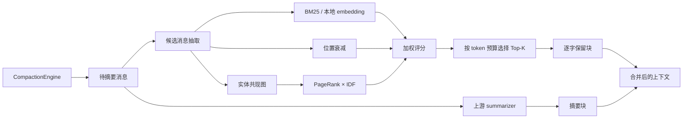

<p align="center">
  
</p>

# PilotDeck-Hippo：面向长上下文压缩的选择性记忆

> **PilotDeck 创造计划 · 方向三（Harness / Memory / 架构优化）**
>
> PilotDeck 上游的 Compaction 会保留最近消息并摘要更早内容。长任务中，基因名、数字、决策等低频事实可能被摘要丢失。Hippo 在压缩前对候选消息评分，按预算逐字保留高价值消息，再与摘要合并，从而提升压缩后事实可恢复性。

> **提交前必填**：在本文件补充公开仓库链接、参赛分支、最终 commit 的完整 SHA 与现场 Demo 入口（见 [§6](#6-fresh-code-与来源说明队长提交前确认)）。方向三的核心交付是公开 GitHub 仓库、可交互 Demo 和海报；无需把方向一/二的材料误当作必交项。

导航：[评委 1 分钟速览](#评委-1-分钟速览) · [评测协议与结果](#4-评测协议与结果) · [快速运行](#3-快速运行源码) · [已知限制](#5-兼容性测试与已知限制) · [上游缺陷修复](#51-顺带修掉的上游缺陷超时定时器被-unref) · [提交清单](#7-方向三提交清单) · [赛事 token 指南（附录 B）](#附录b赛事版指南比赛-token-配置与首次使用)

## 评委 1 分钟速览

| 项目 | 内容 |
|---|---|
| 痛点 | 有损摘要在长对话中遗漏早期的精确事实，Agent 后续无法可靠回答。 |
| 改动 | 在 `CompactionEngine` 增加可选 `scorePolicy`，从待摘要消息中选择性保留高分消息。**引擎层**缺省 = 上游路径（逐字节一致，golden fixture 守护）；**App 层**本 fork 默认开启，`agent.compaction.retention: off` 可一键关回上游。 |
| 方法 | `S(m) = 0.70·语义相关 + 0.15·位置衰减 + 0.15·IDF 校正实体图 PageRank`，按 token 预算选取。 |
| 当前记录结果 | 结构性基准 N=160：事实保留 0/20 → 17.5/20（确定性、随仓库 JSON 复现）。真 LLM 闭环跑了两个条件（不同端点 × 摘要预算），**中文任务两轮一致占优**（N=160：56.3% vs 31.3%；紧预算轮 81.3% vs 0%），英文任务随摘要预算变化——两轮全表与敏感性分析见 [4.3](#43-真-llm-闭环两轮记录含敏感性)，结论以 `benchmarks/results/*.json` 为准。 |
| 现场路径 | 打开 Web UI（http://localhost:3001，本 fork 中 `agent.compaction.retention` 默认 `hippo`，已启用）→ 创建长对话 → 执行 Compaction → 在上下文面板查看保留卡 → 用原问题复问；或直接 `pnpm benchmark:demo`。预计 3–5 分钟。 |

## 1. 问题与设计取舍

上游策略可以概括为"保留最近 tail，其余内容压成摘要"。它对短对话足够有效，但在上下文压力上升时会丢掉不在 tail 中的精确事实。Hippo 只增加一个可开关的保留块：摘要仍负责压缩，保留块负责把少量高价值原文带回上下文。

我们选择本地可计算的特征，避免每次压缩再调用一个大模型：

- **语义相关性**：`sim(q, m)` 中 `q` 是尾部最近一条真实 user 请求。默认 BM25（内部自带 IDF）；设置 `PILOTDECK_BGE_MODEL` 后可切换本地 embedding cosine（`Xenova/bge-small-zh-v1.5`，可离线运行，落在赛事端侧模型额度内）。
- **位置衰减**：当前没有可靠消息时间戳，因此按消息位置计算衰减；它是位置启发式，不等同于真实时间上的艾宾浩斯曲线。
- **实体图核心度**：从消息抽取实体、建共现图、跑 PageRank，再乘 `log(1 + M / df)` 的 IDF，压低在多数消息重复出现的枢纽词。实体抽取双语：ASCII 抽大写驼峰记号，中文用滑动 bigram 免分词抽取 + 高频功能词文档频率剪枝。
- **预算约束**：保留块预算为 `tailTokenBudget × 0.2`，至少 256 tokens；超预算按确定性 tie-break 截断。

默认分数（权重常量 `EBBINGHAUS_DEFAULT_WEIGHTS`，由消融 + 网格搜索重锚，见 [4.2](#42-组件消融)）：

```text
S(m) = 0.70 × sim(q, m)
     + 0.15 × position_decay(m)
     + 0.15 × idf_pagerank(m)
```

没有 query 时 `sim` 退化为常数、不影响排序，保留决策仍由位置与实体图给出。该权重是当前合成协议上的调参结果，不能直接视为所有真实任务的全局最优。

## 2. 架构与数据流



核心接口（与代码一致）：

```ts
const engine = new CompactionEngine({
  model, // 你的摘要模型适配器
  scorePolicy: buildEbbinghausPageRankPolicy({
    wSim: 0.7, wTime: 0.15, wRank: 0.15, // 缺省即该值
  }),
});
const result = await engine.run({ trigger: "auto", messages, keepTailRatio: 0.18 });
```

不传 `scorePolicy` 时走上游路径。App 侧由配置解析成同一个策略，无需改代码：

```ts
// src/context/compaction/retention/EbbinghausPageRankPolicy.ts
resolveRetentionScorePolicy({ retention: "hippo" }) // → EbbinghausPageRankPolicy
resolveRetentionScorePolicy({ retention: "off" })   // → undefined（纯上游）
```

建议在评审时查看以下文件：

- `src/context/compaction/CompactionEngine.ts`：接入开关、候选消息、保留块与合并顺序。
- `src/context/compaction/retention/RetentionTypes.ts`：策略与评分类型。
- `src/context/compaction/retention/MessageText.ts`：统一消息文本化。
- `src/context/compaction/retention/LocalEmbedding.ts`：本地 embedding 与 BM25 fallback。
- `src/context/compaction/retention/EntityGraph.ts`：中英文实体抽取、DF 剪枝、IDF-PageRank。
- `src/context/compaction/retention/EbbinghausScore.ts`、`EbbinghausPageRankPolicy.ts`：评分和预算选择。
- `tests/context/hippo-retention.spec.ts`：专项单测。
- `benchmarks/`：A/B、消融、调参和真 LLM 评测脚本。

## 3. 快速运行（源码）

环境：Node.js `22.13+ <23`、Python 3、`make`、C/C++ 编译器、`ripgrep`。（桌面应用安装包与其他安装方式见[附录 A](#附录a上游-pilotdeck-项目)与[附录 B](#附录b赛事版指南比赛-token-配置与首次使用)。）

```bash
corepack enable
corepack pnpm install --frozen-lockfile
node scripts/bootstrap-pilotdeck-config.mjs   # 生成 ~/.pilotdeck/pilotdeck.yaml
```

在 `~/.pilotdeck/pilotdeck.yaml` 或 Web UI 中配置模型。不要把真实 API Key 写入仓库（环境变量模板见 `.env.example`）：

```yaml
schemaVersion: 1
agent:
  model: custom/<model-id>
  compaction:
    retention: hippo   # 本 fork 默认即 hippo；改为 off 恢复纯上游压缩
model:
  providers:
    custom:
      protocol: openai
      url: https://<接口地址>/v1
      apiKey: ${PILOTDECK_API_KEY}
```

启动 Web UI：

```bash
cd ui && npm run start       # 生产模式（先 vite build），默认 http://localhost:3001
# 开发模式：npm run dev      # 默认 http://localhost:5173
```

若只验证 Hippo，可直接运行：

```bash
corepack pnpm benchmark:no-regression   # scorePolicy 关闭时必须等于上游基线
corepack pnpm benchmark:smoke           # 小规模冒烟
corepack pnpm benchmark                 # 完整 A/B（N=40/80/160 × K=10）
corepack pnpm benchmark:demo            # 大屏 demo
```

真 LLM 评测需要联网，端点解析顺序：① `PILOTDECK_EVAL_URL` + `PILOTDECK_EVAL_KEY` → ② 仓库根 `poliet_deck.txt`（比赛发放网关，密钥不入库）→ ③ `~/deepseek_key.txt`（官方 API）。费用、模型版本、调用参数与 finish_reason 都记录在生成的 JSON 中：

```bash
corepack pnpm benchmark:real-llm
```

## 4. 评测协议与结果

### 4.1 结构性压力测试（fake summarizer）

合成生信对话把 20 条精确事实分散在前 75% 消息，尾部提问要求逐字复述。fake summarizer 不生成 FACT 文本，因此上游 0/20 是"有损摘要 vs 逐字保留"的结构性对照，不能当作真实摘要能力上限。结果为 `pnpm benchmark` 生成的中位数（seed=20260911），seed、原始转录和 JSON 随仓库提交（`benchmarks/results/`）：

| 对话长度 N | 压缩前 tokens | 上游压缩后 | Hippo 压缩后 | 事实保留 /20（上游 → Hippo） |
|---:|---:|---:|---:|---:|
| 40 | 3,906 | 1,153 | 1,381 | 0 → 8 |
| 80 | 8,291 | 2,368 | 2,636 | 0 → 9 |
| 160 | 17,034 | 4,739 | 5,338 | 0 → 17.5 |

即 Hippo 以约 1.11–1.22× 的压缩后 token 换回逐字事实；全部运行确定性为 `true`。

### 4.2 组件消融

同一条公式逐项拆开，在相同转录稿上重跑（协议：EN+ZH、N=40/80/160、10 seeds；中位数）。**权重锁定后应在未参与调参的 seed 上再跑一轮**，结果文件须报告样本数与区间——这是当前未完成项：

| 变体 | EN N=160 | EN N=80 | ZH N=160 | ZH N=80 |
|---|---:|---:|---:|---:|
| sim only | 16 | 7 | 8 | 4 |
| time only | 2 | 2 | 2 | 2 |
| rank only（原始 PageRank） | 0 | 0 | 0 | 0 |
| rank only（+IDF） | 0 | 0 | 1.5 | 1 |
| full（旧默认 0.4/0.35/0.25） | 10.5 | 6.5 | 6 | 5 |
| **full（0.7/0.15/0.15 + IDF）** | **17.5** | **9** | **10** | **6** |

消融发现并当场修掉的两个问题：

1. **枢纽稀释**：原始 PageRank 的枢纽是重复噪音（QC、Step 等每条消息出现的记号），事实消息的独有实体反而低分——rank 项单独 0 分。IDF 校正后中文 rank 项恢复信号（ZH N=40：0 → 3.5）。
2. **权重失配**：旧默认让 time/rank 稀释主力 sim 项。`pnpm benchmark:tune` 在缩减协议（18 配置网格）上重锚为 0.7/0.15/0.15，新默认 6/6 组第一。无 query 探针（`queryHint=""`，BM25 失效的最坏场景）：旧默认全灭（0/60），新默认凭 IDF-rank 与 sim-only 打平（6/60）——这是保留 rank 项的理由。

### 4.3 真 LLM 闭环（两轮记录，含敏感性）

摘要器与评审员均为 DeepSeek-V4-Flash（temperature 0）；每格 = 2 seeds、共 16 道题。同一模型既生成摘要又评审存在模型偏差，以下数字只作可复现实验记录，不替代独立评审或人工抽检。同一天在两个条件下各跑一轮（端点与摘要 `max_tokens` 不同），**结果差异本身就说明单轮真 LLM 数字不可外推**；两轮 JSON 均随仓库提交（`benchmarks/results/real-llm-*.json`，含端点来源、finish_reason 与 token 计费）。

轮次 A —— 官方 API，摘要 `max_tokens=2200`（偏紧。v4-flash 是推理模型，reasoning token 计入 completion 预算，摘要存在被静默截断的风险；A 轮未记录 finish_reason，截断是事后推断而非实测，见已知限制）：

| lang | N | 上游 | Hippo |
|---|---:|---|---|
| en | 80 | 68.8% (11/16)，2,904 tok | 68.8% (11/16)，3,081 tok |
| en | 160 | 12.5% (2/16)，4,977 tok | **87.5% (14/16)**，5,769 tok |
| zh | 80 | 0% (0/16)，2,340 tok | 18.8% (3/16)，2,319 tok |
| zh | 160 | 0% (0/16)，4,002 tok | **81.3% (13/16)**，4,964 tok |

轮次 B —— 比赛网关，摘要 `max_tokens=4000`（32 次摘要调用中 6 次触顶，已逐格记录）：

| lang | N | 上游 | Hippo |
|---|---:|---|---|
| en | 80 | 100% (16/16)，3,402 tok | 100% (16/16)，3,704 tok |
| en | 160 | 100% (16/16)，5,955 tok | 100% (16/16)，6,278 tok |
| zh | 80 | 0% (0/16)，2,075 tok | **62.5% (10/16)**，2,958 tok |
| zh | 160 | 31.3% (5/16)，4,586 tok | **56.3% (9/16)**，4,912 tok |

两轮合看的三点解读：

1. **中文任务上 Hippo 两轮一致占优（4/4 格）**。v4-flash 写中文摘要时不逐字保留数字事实（上游压缩后 FACT 标记 0/20），Hippo 保留块直接把原文带回上下文。
2. **英文任务的结果由摘要预算调节**。预算紧（A 轮）时上游 N=160 崩到 12.5%；预算放开（B 轮）后上游靠"把检查点逐条抄进更长摘要"回到 100%，摘要 tokens 随之上浮（en N=160：4,977 → 5,955）。即上游要保住精确事实，要么受截断之害，要么为膨胀摘要多付 token；Hippo 用受控预算的逐字保留块达成同样目标。
3. **方差声明**：每格仅 16 题、2 seeds、同模型 judge，官方 API 与比赛网关的服务差异未知。因此只声明方向性结论（中文稳定占优、英文随摘要预算变化），不宣称单一"提升 X 点"。

### 4.4 打分延迟（效率代价）

策略打分是本地计算，中位延迟：EN ≈ 15–60 ms、ZH ≈ 185–565 ms（N=40→160；中文 bigram 实体数约为英文 5–10 倍，图更大）。对比一次真实 LLM 摘要调用（秒级），打分开销 ≈5–15%，且压缩是低频事件。优化路径（每消息实体截断、PageRank 减迭代）已留参数。测量脚本：`pnpm benchmark:ablation`（wall ms 列）；具体机器信息见结果 JSON。

## 5. 兼容性、测试与已知限制

- 两层开关口径：**引擎层** `scorePolicy` 缺省 = 上游路径，由 `benchmark:no-regression` 与 golden fixture（`benchmarks/baseline-85be774.json`）验证输出逐字节一致；**App 层** 本 fork 默认启用（`agent.compaction.retention: hippo`），`off` 可整体关回上游。
- 每个会话有独立的 CompactionEngine（按 `sessionId` 构造），评分策略无可变跨调用状态、EntityGraph 每次压缩重建——**中途切换会话/项目不会串上下文**。压缩被中断（切走、网络失败、摘要失败）时 transcript 逐字节不变，下次触发重新压缩，这也是上游既有保证。
- 策略评分失败会自动退回纯摘要路径（try/catch 兜底），不让一次打分异常拖垮整个回合。
- 端侧 embedding 按模型路径缓存（同进程只加载一次，多会话共享），单次加载超过 15 秒按失败处理并回退 BM25，避免冷启动/下载卡住压缩。
- 测试数量声明需可复核：当前工作树 2026-09-11 实测全仓 **481 通过 / 0 失败**（485 项 = 481 通过 + 2 项计时敏感用例在满载并发下偶发 cancelled + 2 skipped；这 2 项单独运行 11/11 全通过）。修复前同口径为 477 通过 / 8 cancelled。

### 5.1 顺带修掉的上游缺陷：超时定时器被 unref

排查"用户中途切换会话/项目"时顺带发现并修复了一处上游真实缺陷（`src/network/fetch.ts`，非本 fork 引入）：

该模块把请求超时定时器与重试退避定时器都 `unref()` 了。`unref()` 的语义是"此定时器不阻止进程退出"——但当底层 fetch 实现自身不持有 libuv 句柄（mock/轻量实现，或某些短生命周期 CLI 调用）时，进程会在定时器触发前就退出，于是**超时静默失效、重试被跳过**。表现是调用方拿到一个永不 settle 的 promise，而不是预期的 `network_timeout`。

- 修复：去掉这两处 `unref()`（超时定时器在 `finally` 中清理，重试延时定时器触发后自行清除，都不会拖住进程）。
- 证据：修复前 `tests/network/fetch.spec.js` 7 项全部 cancelled；修复后 7/7 通过，全仓 cancelled 由 8–9 降到 2（余下 2 项为满载并发的计时抖动，单独运行全绿）。
- 影响面：这是所有模型 provider / MCP 网络调用的公共底座，属"用户端问题"，故一并修掉并记在这里，不计入 Hippo 创新点。
- 真 LLM 轮次 A 未记录 finish_reason，"上游英文崩盘源于摘要截断"是事后推断（依据：B 轮放开预算后上游回到 100%，且 B 轮实测 6/32 次触顶）；该归因尚未被直接测量。
- 未安装 Transformer.js、embedding 模型缺失或加载失败时自动回退 BM25，不报错、不崩溃；模型版本、缓存路径与离线安装说明见 `.env.example`。
- 中文 bigram 会增大实体图（延迟见 4.4）；现场应同时报告硬件与测量脚本。
- 评测主要是合成对话：事实分布偏前且 query 在尾部，time 项在该分布上天然反相关；真实任务的时间特征、噪声和多轮 query 可能改变权重最优点——权重结论以"同分布最优"为口径。
- 真 LLM 结果样本量小（每格 16 题）且摘要器与 judge 同模型；后续应加入独立 judge、人工抽检与未见任务集。
- Hippo 会增加压缩后 token（真 LLM 记录约 +5–24%，视轮次与格子）；展示时应同时给准确率与成本，不能只报准确率。

## 6. Fresh Code 与来源说明（队长提交前确认）

- [ ] Hippo 核心代码、专项测试、benchmark、设计稿和 Demo 在 **2026-09-11 14:00 之后**由参赛队员现场创建。
- [x] 已保留上游基线的仓库链接与改动范围：基线 `https://github.com/OpenBMB/PilotDeck`，基线 commit 前缀 `85be774`（golden fixture 锁定其行为）。
- [ ] 未携带成熟 Demo、商业项目或未报名人员完成的核心代码/设计/调试/文案。
- [ ] 公开开源项目、模型、API 和素材均在本节或 `NOTICE` 中标注来源及许可证。
- [ ] 仓库历史能通过 `git log --stat`、GitHub commit 时间和现场截图复核；所有 benchmark JSON 均脱敏，不含 API Key。

基线信息（本仓库已 git 化，主分支 `main`；完整 SHA 由队长在提交时补全）：

```text
上游仓库：https://github.com/OpenBMB/PilotDeck
基线完整 SHA：85be774…（<full-40-char-sha> 待补，不要只写短前缀）
参赛分支：main
最终提交 SHA：<full-40-char-sha>（提交后回填）
```

仓库卫生：`.gitignore` 已排除 `poliet_deck.txt`（比赛网关凭据）、`*_key.txt`、`.env*`、`node_modules/`、`dist/`；`benchmarks/results/*.json` 已确认不含任何 API Key，随仓库提交以便复核。

## 7. 方向三提交清单

在 2026-09-12 12:00 前由队长提交：

1. 公开 GitHub 代码仓链接（含本 README、测试和 benchmark 结果）。
2. 可交互 Demo 入口：现场 `pnpm benchmark:demo` 与 Web UI（:3001），准备 3–5 分钟复现路径。
3. A3 竖版海报：297×420 mm、300 DPI、3508×4961 px、CMYK、四边 3 mm 出血；正文 ≥10 pt，标题 ≥18 pt，重要文字距边 ≥5 mm——排版由团队完成，文案/版式/数据图索引见 [docs/展位讲解与海报素材.md](docs/展位讲解与海报素材.md)。
4. README 中的改进点、架构/模块、运行方式、性能前后对比、已知限制和技术设计图（即本文件）。
5. 可选加分材料：演示视频、CI/测试输出、`benchmarks/results/` 原始 JSON、独立评审或人工抽检记录。
6. 方向三使用主办方当天公布的额外提交链接；不要误传方向一/二的小程序链路。

## 8. 许可证与上游致谢

本改造基于 [OpenBMB/PilotDeck](https://github.com/OpenBMB/PilotDeck)（AGPL-3.0），遵循仓库中的许可证和 NOTICE。最终仓库将保留上游版权声明，并补充 Hippo 改动的作者、日期、基线 SHA 与第三方依赖清单。

## 附录A：上游 PilotDeck 项目

**PilotDeck** 是由清华大学 [THUNLP](https://nlp.csai.tsinghua.edu.cn/) 实验室、[面壁智能](https://modelbest.cn/)、[OpenBMB](https://www.openbmb.cn/) 与 [AI9Stars](https://github.com/AI9Stars) 联合研发的开源 Agent 上下文工程框架：以 WorkSpace 为单位隔离文件、记忆与技能，提供白盒记忆、智能路由、Always-on 等能力，原生支持 [MCP](https://modelcontextprotocol.io/)。本仓库只改动了其上下文压缩模块（见上文），其余能力与上游一致。

- 官网：<https://pilotdeck.openbmb.cn> · 在线体验：<https://pilotdeck.openbmb.cn/pilotdeck.github.io/demo/p/pilotdeck-demo> · 文档：<https://pilotdeck.openbmb.cn/pilotdeck.github.io/docs/en/introduction>
- 一键安装脚本、Docker Compose、插件体系（Extension Protocol）与社区（Discord / 飞书 / 微信）见上游仓库 README：<https://github.com/OpenBMB/PilotDeck>
- 桌面应用安装包：

| Platform | File |
| :--- | :--- |
| macOS (arm64) | [PilotDeck-2026.910.0-mac-arm64.dmg](https://github.com/OpenBMB/PilotDeck/releases/download/v2026.09.10/PilotDeck-2026.910.0-mac-arm64.dmg) |
| macOS (x64) | [PilotDeck-2026.910.0-mac-x64.dmg](https://github.com/OpenBMB/PilotDeck/releases/download/v2026.09.10/PilotDeck-2026.910.0-mac-x64.dmg) |
| Windows (x64) | [PilotDeck-2026.910.0-win-x64-setup.exe](https://github.com/OpenBMB/PilotDeck/releases/download/v2026.09.10/PilotDeck-2026.910.0-win-x64-setup.exe) |

<details>
<summary>macOS 提示「应用已损坏 / 无法验证开发者」</summary>

```bash
xattr -cr /Applications/PilotDeck.app
```

</details>

引用上游：

```bibtex
@misc{pilotdeck2026,
  author       = {PilotDeck Team},
  title        = {PilotDeck: A WorkSpace-Centric Open-Source Agent Operating System},
  howpublished = {\url{https://github.com/OpenBMB/PilotDeck}},
  year         = {2026}
}
```

## 附录B：赛事版指南（比赛 token 配置与首次使用）

> 本附录面向本次赛事选手：赛事 token 配置、网页搜索、Web UI 首次使用与常见问题。

### 配置赛事发放的 token（Web UI 可视化配置，推荐）

本次赛事 token 资源包：

- **价值 400 元的云端大模型 token**：用于接入 PilotDeck 执行任务。提交组队表单后，【接口地址】和【API密钥】将发送到队长邮箱。
- **价值 100 元的端侧模型 token**：可在自己的作品中接入（Hippo 的本地 embedding 即可跑在端侧额度上）；可按需申请额外 200 元额度。

配置步骤：

1. 启动 PilotDeck 并打开 Web UI（默认 `http://localhost:3001`），在 onboarding 面板点击【开始配置】。
2. 使用赛事发放的 token，请点击【自定义】。
3. 填入队长邮箱收到的【接口地址】与【API密钥】。接口地址需要填到 `v1`（形如 `https://api.deepseek.com/v1`）。
4. 在【待选模型】中点选想用的模型并添加（可多选）——出现在【已选用模型】里才算点选成功。
5. 点击【测试连接】，显示绿色即为通过。

本次赛事可选模型包括：**Hy3、DeepSeek-V4-Flash、DeepSeek-V4-Flash-Vision、GLM-5.3、GLM-5.2、GLM-5.3-Flash、MiniMax-M3**（实际模型 ID 可能有前缀）。

等价的配置文件方式（`~/.pilotdeck/pilotdeck.yaml`）：

```yaml
schemaVersion: 1
agent:
  model: custom/<model-id>
model:
  providers:
    custom:
      protocol: openai
      url: https://<赛事接口地址>/v1
      apiKey: <队长邮箱收到的 API Key>
```

### 配置网页搜索

如需【网页搜索】功能，点击左下角【Settings】→【Search】页面选择搜索服务提供商并配置对应的 API Key（一般都有免费额度）：

| Provider 名 | 服务商 | 获取 Key 的网站 |
| :--- | :--- | :--- |
| tavily | Tavily | https://app.tavily.com |
| glm | Z.AI / 智谱 | https://open.bigmodel.cn |
| serper | Serper（Google SERP） | https://serper.dev |
| brave | Brave Search API | https://brave.com/search/api |

### Web UI 使用指南

- **界面概览**：导航包含 Files、Skills、Routing（智能路由）、Memory、Always-On 等模块；左侧为 Projects 项目列表，可在 new conversation 直接创建对话，或进入各项目工作区。
- **创建项目与进入工作区**：每个项目拥有独立的文件系统、记忆、技能与会话历史，项目间互不干扰。
- **发起任务（Ask / Plan 模式）**：在输入框直接用自然语言描述目标；支持 `@文件` 引用工作区文件；可切换 Ask / Plan 模式、设置权限（如 Full Access）、调整上下文。
- **白盒记忆管理**：Memory 模块定期沉淀长期上下文（用户偏好、项目背景、常用路径、关键决策）。可以查看每条记忆的来源与所属 WorkSpace、搜索记忆、修正不准确的记录，必要时直接修改或删除。
- **定时任务与 Always-on**：在输入框直接描述定时任务（例如「每天上午 10 点给我推送最新新闻」），Agent 会自动创建对应的 Cron Job；在 Always-On 页面可查看全部计划与定时任务。

### 赛事 FAQ

| 问题 | 解决方法 |
| :--- | :--- |
| 测试连接失败 | 检查 API Key 是否正确、网络是否可达、Provider 余额是否充足、接口地址是否包含 `/v1` |
| `pilotdeck: command not found` | `echo 'export PATH="$HOME/.local/bin:$PATH"' >> ~/.zshrc && source ~/.zshrc` |
| 端口冲突（Port 3001/18080 already in use） | `lsof -i :3001 && kill -9 <PID>` |
| `npm install` 失败 | `npm cache clean --force && rm -rf node_modules package-lock.json && npm install --registry=https://registry.npmmirror.com` |
| Windows 报 `npm.ps1` 禁止运行脚本 | `Set-ExecutionPolicy -Scope CurrentUser -ExecutionPolicy RemoteSigned` 后重开 PowerShell，或显式调用 `npm.cmd run dev` |
| 其他问题 | 先尝试刷新页面；仍无法解决可在赛事社群反馈或找现场技术人员 |

## 许可证

AGPL-3.0，详见 [LICENSE](LICENSE)。
