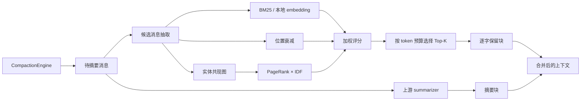

<p align="center">
  
</p>

# PilotDeck-Hippo：面向长上下文压缩的选择性记忆

> **PilotDeck 创造计划 · 方向三（Harness / Memory / 架构优化）**

> **语言：** [中文](README.md) · [English](README.en.md) · **在线 Demo：** <https://qgeng1465.github.io/pilotdeck-hippo/>

> **提交前待办**见 [§6](#6-fresh-code-与来源说明队长提交前确认)。方向三的交付：公开 GitHub 仓库（本仓库）、在线 Demo（[qgeng1465.github.io/pilotdeck-hippo](https://qgeng1465.github.io/pilotdeck-hippo/)，展示 2026-09-12 修掉的两个保留/渲染缺陷的实机运行）、海报。

导航：[核心思路](#核心思路) · [核心作用（真实数据）](#核心作用它到底解决什么) · [评测协议与结果](#4-评测协议与结果) · [快速运行](#3-快速运行源码) · [已知限制](#5-兼容性测试与已知限制) · [上游缺陷修复](#51-顺带修掉的三个上游缺陷) · [提交清单](#7-方向三提交清单) · [赛事 token 指南（附录 B）](#附录b赛事版指南比赛-token-配置与首次使用)

## 核心思路

上下文压缩是有损的。上游 `CompactionEngine` 在上下文吃紧时会保留最近一段（tail）的**原文**，把更早的历史**摘要成一段文字**。摘要保得住"大意"，但很容易丢掉低频的精确事实，比如基因名、频率数字、文件路径、检查点、决策记录，而这些正是 Agent 之后要逐字复述的东西。

Hippo 不打算做一个"更好的摘要器"。那仍然是在有损框架里抬质量上限，还更费 token。Hippo 直接改机制：**让一部分内容根本不进入有损处理。**

在压缩发生前，对即将被摘要掉的消息逐条打分，按一个**固定、有上限**的 token 预算挑出得分最高的若干条，让它们的**原文**与摘要一起进入压缩后的上下文：

```text
S(m) = 0.85 × sim(q, m)          # 与当前待办请求的语义相关度（BM25；可选本地 embedding）
     + 0.15 × position_decay(m)  # 越靠近当前越可能相关
     + 0.00 × idf_pagerank(m)    # 实体共现图核心度；默认权重 0，见 §4.2 的原因
```

三条设计约束，也是它与"再调一次摘要 prompt"的区别：

- **预算是硬的**：保留块预算 = tail 预算的 20%，下限 256 tokens，上限封死。压缩后上下文的大小仍然可控，不会因为"想多记一点"而失控。
- **输出是原文，不是转述**：被保留的消息逐字进入上下文，不受摘要模型能力波动影响。
- **失败即退让**：打分抛错、模型缺失、embedding 加载超时，一律退回纯上游摘要路径，不阻塞对话。

## 核心作用（它到底解决什么）

**一句话：在同样约 1.1–1.2 倍的压缩后 token 下，让压缩后的上下文里"逐字可用的精确事实"从 0 条变成多数条。**

下表的每条数字都来自 `benchmarks/results/*.json`，用**从未参与过任何调参的 seed（20260921–20260930，n=10）** 重新跑过——不是见过 seed 上的最好成绩。指标是 20 条注入事实中，压缩后上下文里**逐字**（而非转述）仍在的条数：

| 场景 | 上游（无保留） | Hippo（当前默认） | 10 个 seed 中 Hippo 胜/平/负 |
|---|---:|---:|---|
| 英文 N=160 | 0 / 20 | **17.9 / 20** | 10 / 0 / 0（符号检验 p=0.002） |
| 中文 N=160 | 0 / 20 | **10.0 / 20** | 10 / 0 / 0（p=0.002） |
| 英文 N=80 | 0 / 20 | **9.4 / 20** | 10 / 0 / 0（p=0.002） |
| 中文 N=80 | 0 / 20 | **6.0 / 20** | 10 / 0 / 0（p=0.002） |

上游的 0 来自"有损摘要 + 不生成 FACT 文本的假摘要器"，是**结构性对照**（有损 vs 逐字），不是真实摘要能力的上限——真 LLM 的对照见 [§4.3](#43-真-llm-闭环两轮记录含敏感性)（该节用 2 seeds/格、自有 seed，与上表不是同一批，两套数字不混用）。真 LLM 闭环里中文任务两轮 4/4 格 Hippo 占优。

**"准不准"我们也量了，不是只说召回**：返回的保留了 20 条事实之外，我们还用引擎自曝的保留块逐消息算了**精度**——保留块里几乎全是 query 需要的事实，没掺成堆的无关联（EN/ZH × N=40/80/160 精度 **89–100%**，2.7–11× 高于随机基线；召回受保留预算限制，代价写在同一张表里）。判断一位只问召回会漏掉"会不会把整段历史一股脑塞回"这种假阳性；精度回答了它，见 [§4.1a](#41a-提取精度逐消息精召回直接回答怎么保证提取得准)。

**它对你（一个真实用户）意味着什么**：长任务跑了几十轮之后，你问"前面那个 TP53 的频率是多少"，Agent 不该只能说"根据之前的摘要，大约是……"。Hippo 让这类问题仍然能拿到原文数字。

## 评委 1 分钟速览

| 项目 | 内容 |
|---|---|
| 痛点 | 有损摘要在长对话中遗漏早期的精确事实，Agent 后续无法可靠回答。 |
| 改动 | 在 `CompactionEngine` 增加可选 `scorePolicy`，从待摘要消息中选择性保留高分消息。**引擎层**缺省 = 上游路径（逐字节一致，golden fixture 守护）；**App 层**本 fork 默认开启，`agent.compaction.retention: off` 可一键关回上游。 |
| 方法 | `S(m) = 0.85·语义相关 + 0.15·位置衰减 + 0.00·IDF 校正实体图 PageRank`，按 token 预算选取。rank 项权重落 0 是留出集上的结论，原因与取舍见 [4.2](#42-组件消融)。 |
| 当前记录结果 | 结构性基准 N=160：事实保留 0/20 → 17.9/20（**从未参与调参的 10 个 seed 上 10 胜 0 平 0 负，符号检验 p=0.002**，随仓库 JSON 复现）；**提取精度（逐消息）89–100%，2.7–11× 高于随机**（[4.1a](#41a-提取精度逐消息精召回直接回答怎么保证提取得准)）。真 LLM 闭环跑了两个条件（不同端点 × 摘要预算），**中文任务两轮一致占优**（N=160：56.3% vs 31.3%；紧预算轮 81.3% vs 0%），英文任务随摘要预算变化——两轮全表与敏感性分析见 [4.3](#43-真-llm-闭环两轮记录含敏感性)，结论以 `benchmarks/results/*.json` 为准。 |
| 现场路径 | 打开 Web UI（`pnpm dev`，vite 客户端默认 http://localhost:5173，3001/5173 被占用会自动滑动，以启动日志 `[dev-launcher]` 打印为准；本 fork 中 `agent.compaction.retention` 默认 `hippo`，已启用）→ 创建长对话 → 触发 Compaction → **压缩分隔线上会直接显示保留徽章**（如「Hippo 逐字保留 3 条（1,204 tok）」，悬停给出策略与本次预算）→ 用原问题复问；或直接 `pnpm benchmark:demo`。预计 3–5 分钟。 |
| 已知边界（我们主动划的） | ① 收益是"对**当前任务**保真"，**不是**"记住被放弃的旧话题"——旧话题优势经诊断是 harness 句式共享造成的假象，[4.6](#46-话题切换旧话题还剩多少回答中途换话题)；② 换成**真摘要器**后这条优势变成条件句：摘要预算宽裕时测不出差异（同配置重复的摆动就有 3–4 题），**预算吃紧时**才测得出（当前话题 10/16 → 16/16，摆动为 0），[4.7](#47-真摘要器下的话题切换46-第一条边界的补充测量)；③ 改默认权重的理由是"对齐调参 argmax + 少一项"，**不是**"权重优化带来提升"（该对比留出集上不显著，[4.5](#45-留出集验证选过参数的-seed-一律不用)）。 |

## 1. 问题与设计取舍

上游策略可以概括为"保留最近 tail，其余内容压成摘要"。它对短对话足够有效，但在上下文压力上升时会丢掉不在 tail 中的精确事实。Hippo 只增加一个可开关的保留块：摘要仍负责压缩，保留块负责把少量高价值原文带回上下文。

我们选择本地可计算的特征，避免每次压缩再调用一个大模型：

- **语义相关性**：`sim(q, m)` 中 `q` 是尾部最近一条真实 user 请求。默认 BM25（内部自带 IDF）；设置 `PILOTDECK_BGE_MODEL` 后可切换本地 embedding cosine（`Xenova/bge-small-zh-v1.5`，可离线运行，落在赛事端侧模型额度内）。
- **位置衰减**：当前没有可靠消息时间戳，因此按消息位置计算衰减；它是位置启发式，不等同于真实时间上的艾宾浩斯曲线。
- **实体图核心度**：从消息抽取实体、建共现图、跑 PageRank，再乘 `log(1 + M / df)` 的 IDF，压低在多数消息重复出现的枢纽词。实体抽取双语：ASCII 抽大写驼峰记号，中文用滑动 bigram 免分词抽取 + 高频功能词文档频率剪枝。
- **预算约束**：保留块预算为 `tailTokenBudget × 0.2`，至少 256 tokens；超预算按确定性 tie-break 截断。

默认分数（权重常量 `EBBINGHAUS_DEFAULT_WEIGHTS`，由消融 + 网格搜索重锚，并在**未见 seed** 上复核，见 [4.2](#42-组件消融)）：

```text
S(m) = 0.85 × sim(q, m)
     + 0.15 × position_decay(m)
     + 0.00 × idf_pagerank(m)     # 权重 0，公式项仍保留、可配置
```

第三项默认权重为 **0**：网格搜索的最优点是 `0.85/0.15/0.00`，而 rank 项在留出集上一对一比较 **7 胜 / 33 平 / 0 负，四个格子无一显著**（p = 1 / 0.5 / 1 / 0.125）——去掉它不吃亏，但也没带来可测量的收益，所以不占权重，但代码与配置项保留，供其他分布启用。该权重是当前合成协议上的调参结果，不能直接视为所有真实任务的全局最优；**我们不宣称"权重优化带来了提升"**，换默认值的依据是对齐调参 argmax 且少一项（三项变两项），真正的主效应是"逐字保留 vs 不做保留"（§4.5）。

没有 query 时 `sim` 退化为常数 `0.5`、对排序没有贡献；此时默认权重下 `wRank` 同样是 0，于是排序**只由时近度决定**——这正是无 query 场景各项指标都接近地板的原因。所以 CompactionEngine 现在做的是**避免误入该场景**而不是给 rank 加权兜底：尾部取不到用户请求时，回退到全对话中最近的一条真实用户请求（§4.2 第 4 条）。

## 2. 架构与数据流



核心接口（与代码一致）：

```ts
const engine = new CompactionEngine({
  model, // 你的摘要模型适配器
  scorePolicy: buildEbbinghausPageRankPolicy({
    wSim: 0.85, wTime: 0.15, wRank: 0, // 缺省即该值；wRank>0 可重新启用实体图项
  }),
});
const result = await engine.run({ trigger: "auto", messages, keepTailRatio: 0.18 });
```

不传 `scorePolicy` 时走上游路径。App 侧由配置解析成同一个策略，无需改代码：

```ts
// src/context/compaction/retention/EbbinghausPageRankPolicy.ts
resolveRetentionScorePolicy({ retention: "hippo" }) // → EbbinghausPageRankPolicy
resolveRetentionScorePolicy({ retention: "off" })   // → undefined（纯上游）
```

建议在评审时查看以下文件：

- `src/context/compaction/CompactionEngine.ts`：接入开关、候选消息、保留块与合并顺序。
- `src/context/compaction/retention/RetentionTypes.ts`：策略与评分类型。
- `src/context/compaction/retention/MessageText.ts`：统一消息文本化。
- `src/context/compaction/retention/LocalEmbedding.ts`：本地 embedding 与 BM25 fallback。
- `src/context/compaction/retention/EntityGraph.ts`：中英文实体抽取、DF 剪枝、IDF-PageRank。
- `src/context/compaction/retention/EbbinghausScore.ts`、`EbbinghausPageRankPolicy.ts`：评分和预算选择。
- `tests/context/hippo-retention.spec.ts`：专项单测。
- `benchmarks/`：A/B、消融、调参和真 LLM 评测脚本。

## 3. 快速运行（源码）

环境：Node.js `22.13+ <23`、Python 3、`make`、C/C++ 编译器、`ripgrep`。（桌面应用安装包与其他安装方式见[附录 A](#附录a上游-pilotdeck-项目)与[附录 B](#附录b赛事版指南比赛-token-配置与首次使用)。）

```bash
corepack enable
corepack pnpm install --frozen-lockfile
node scripts/bootstrap-pilotdeck-config.mjs   # 生成 ~/.pilotdeck/pilotdeck.yaml
```

在 `~/.pilotdeck/pilotdeck.yaml` 或 Web UI 中配置模型。不要把真实 API Key 写入仓库（环境变量模板见 `.env.example`）：

```yaml
schemaVersion: 1
agent:
  model: custom/<model-id>
  compaction:
    retention: hippo   # 本 fork 默认即 hippo；改为 off 恢复纯上游压缩
model:
  providers:
    custom:
      protocol: openai
      url: https://<接口地址>/v1
      apiKey: ${PILOTDECK_API_KEY}
```

启动 Web UI：

```bash
cd ui && npm run start       # 生产模式（先 vite build），默认 http://localhost:3001
# 开发模式：npm run dev      # 默认 http://localhost:5173
```

若只验证 Hippo，可直接运行：

```bash
corepack pnpm benchmark:no-regression   # scorePolicy 关闭时必须等于上游基线
corepack pnpm benchmark:smoke           # 小规模冒烟
corepack pnpm benchmark                 # 完整 A/B（N=40/80/160 × K=10）
corepack pnpm benchmark:demo            # 大屏 demo
corepack pnpm benchmark:tokenizer       # 分词器两实现的时间/加速表（§5.1 缺陷二）
corepack pnpm benchmark:extraction      # 逐消息精/召回，回答"怎么保证提取得准"（§4.1a）
```

真 LLM 评测需要联网，端点解析顺序：① `PILOTDECK_EVAL_URL` + `PILOTDECK_EVAL_KEY` → ② 仓库根 `poliet_deck.txt`（比赛发放网关，密钥不入库）→ ③ `~/deepseek_key.txt`（官方 API）。生成的 JSON 记录端点来源、模型版本与三方 token 账本（摘要 prompt / 摘要 completion / 评审 prompt）；**摘要输出上限与每次调用的 `finish_reason` 是从 2026-09-11 这次改动起才落库的**——已提交的两轮 JSON 里没有，所以 §4.3 里"摘要被截断"只能写成推断（原因与影响见 §4.3）：

```bash
corepack pnpm benchmark:real-llm                # §4.3 单话题闭环
corepack pnpm benchmark:real-llm-topic-switch   # §4.7 话题切换闭环（含重复内方差，可调 PILOTDECK_EVAL_REPEATS）
```

## 4. 评测协议与结果

### 4.1 结构性压力测试（fake summarizer）

合成生信对话把 20 条精确事实分散在前 75% 消息，尾部提问要求逐字复述。fake summarizer 不生成 FACT 文本，因此上游 0/20 是"有损摘要 vs 逐字保留"的结构性对照，不能当作真实摘要能力上限。下表为 `pnpm benchmark` 生成的中位数（seed=20260911），出自 `benchmarks/results/2026-09-11T11-16-22-522Z.json`：

| 对话长度 N | 压缩前 tokens | 上游压缩后 | Hippo 压缩后 | 事实保留 /20（上游 → Hippo） |
|---:|---:|---:|---:|---:|
| 40 | 3,906 | 1,153 | 1,381 | 0 → 8 |
| 80 | 8,291 | 2,368 | 2,634 | 0 → 9 |
| 160 | 17,034 | 4,739 | 5,339 | 0 → 18 |

即 Hippo 以约 1.11–1.20× 的压缩后 token 换回逐字事实；全部运行确定性为 `true`。**代价写在明处**：这 11–20% 是多出来的，不是省下来的——Hippo 换的是"压缩后仍能逐字复现事实"，不是"压得更狠"。

### 4.1a 提取精度（逐消息精/召回）——直接回答"怎么保证提取得准"

上面的 `0/20→8/9/18` 是**召回**——query 需要复述的 20 条事实保住几条；它没说保留块里是不是混进了大量无关消息。本节用引擎自曝的 `retention.retainedMessageTexts`（评分选中并真正进入压缩后上下文的那些消息，**不用指纹反推，无重建伪影**）按消息粒度量精/召回，留出集 seed（2026-09-21 起）跑 `pnpm benchmark:extraction`（JSON：`benchmarks/results/extraction-precision-2026-09-11T13-39-26-139Z.json`）：

| lang | N | 召回（保住几分之几） | 精度（保留块里相关消息占比） | 随机基线 | 相对随机 |
|---|---:|---:|---:|---:|---:|
| en | 40 | 6/20 | **100%** | 36% | 2.8× |
| en | 80 | 7/20 | **100%** | 18% | 5.7× |
| en | 160 | 16/20 | **100%** | 9% | 11× |
| zh | 40 | 4/20 | **100%** | 37% | 2.7× |
| zh | 80 | 4/20 | **100%** | 18% | 5.6× |
| zh | 160 | 8/20 | **89%** | 9% | 10× |

（召回与 §4.1 略异：那是 seed 20260911 的调参协议，这里是留出集 seed，且按"消息数"而非"标记数"计数；两者都是预算内召回。）

1. **精度高 = 打分真的把信号和噪音分开了**：保留块几乎全是当前 query 需要的事实消息（唯有 zh N=160 混进一条噪音），2.7–11× 高于随机——它不是在把整段历史一股脑塞回来。
2. **召回受 token 预算限制**：保留预算（≤256 tok，实测用掉 88–99%）只够带 4–16 条。**代价是明着的**：保住最相关的，托不住全部——这正是主基准"有代价换保真"（1.11–1.20× token）的同一条口子。
3. **怎么保证**：这不保证任意真实任务选得对——打分仍是无监督启发式。它保证的是可测的这两点——**一旦选中，几乎必然相关（精度），且逐字无损（续 §4.1）；代价和边界都写在表里**。

### 4.2 组件消融

同一条公式逐项拆开，在相同转录稿上重跑（协议：EN+ZH、N=40/80/160、10 seeds；中位数。出自 `benchmarks/results/ablation-2026-09-11T11-17-30-040Z.json`）：

| 变体 | EN N=160 | EN N=80 | ZH N=160 | ZH N=80 |
|---|---:|---:|---:|---:|
| sim only | 16 | 7 | 8 | 4 |
| time only | 2 | 2 | 2 | 2 |
| rank only（原始 PageRank） | 0 | 0 | 0 | 0 |
| rank only（+IDF） | 0 | 0 | 1.5 | 1 |
| full（旧默认 0.4/0.35/0.25） | 10.5 | 6.5 | 6 | 5 |
| **full（当前默认 0.85/0.15/0.00）** | **18** | **9** | **10** | **6** |

（表内为调参协议下的中位数。"上一版默认 0.7/0.15/0.15" 不在此表——它与当前默认的差异用**留出集**做配对检验，见 §4.5 与下方第 3 条，两套协议的数字不混用。）

消融发现并当场修掉的三个问题：

1. **枢纽稀释**：原始 PageRank 的枢纽是重复噪音（QC、Step 等每条消息出现的记号），事实消息的独有实体反而低分——rank 项单独 0 分。IDF 校正后中文 rank 项恢复信号（ZH N=40：0 → 3.5）。
2. **权重失配**：旧默认让 time/rank 稀释主力 sim 项。`pnpm benchmark:tune` 在 18 配置网格（N=80 × 3 seeds × 2 langs）上重锚，当前默认 **72/120 居首**，且在 6 个 `(语言 × N)` 格子里全部第一（§4.2 的表因排版只列了 4 格；含 N=40 的完整 6 格在消融 JSON 里）。
3. **默认值不是最优解**（留出集复核发现）：上面那张网格的 **argmax 是 `0.85/0.15/0.00`（72/120），而代码里当时常量写的是 `0.7/0.15/0.15`（68/120）**——默认值偏离了调参结果本身。在从未参与调参的 seed 20260921–20260930 上做一对一配对比较（§4.5），rank 项 **7 胜 / 33 平 / 0 负，四个格子无一显著**（p = 1 / 0.5 / 1 / 0.125）。

   **怎么解决的**：把 `EBBINGHAUS_DEFAULT_WEIGHTS` 改为 `{0.85, 0.15, 0}`，与调参 argmax 对齐；rank 项**不删除**，只是权重落 0，公式、实体图代码与 `wRank` 配置项全部保留，需要时一行配置即可重新启用。同时补了一处机制性防护：`holdout.ts` 里「当前默认」一行直接读 `EBBINGHAUS_DEFAULT_WEIGHTS` 常量，而不是抄一份字面量，**默认值再漂移会在留出集表格里直接现形**。

   **诚实边界**：改了权重但**不宣称提升**。留出集上 rank 项 0 负只是说明"去掉它不吃亏"，7 胜 33 平说明效应远小于噪声——真正的依据是它对齐了调参 argmax 且更简单（三项变两项），不是它带来了多少分。相对上游（完全不做保留）的 17.9 / 9.4 / 10.0 / 6.0 才是本文的主效应，四个格子均 10 胜 0 平 0 负、p=0.002。

4. **无 query 时保留退化**（本轮新发现并修掉）：压缩不一定由新用户请求触发——一条超长工具输出撑爆预算同样触发。此时 tail 窗口里没有用户消息，`queryHint` 退化为空串，相似度项归零：留出集 no-query 探针显示当前默认仅保留 **0.00–0.20 / 20** 条事实，而纯 sim 能保留 1–2 条。这不是权重问题——把 rank 权重加回去也救不回主路径（见上）。

   **怎么解决的**：修成因，不加权重。`CompactionEngine` 现在在 tail 找不到真实用户请求时，回退到**全对话中最近的一条真实用户请求**（仍是被压缩消息所服务的那条请求），而不是空串。回归测试 `tests/context/hippo-retention.spec.ts`「retention is still query-conditioned when the tail holds no user request」在撤销该修复后确定性失败（实测策略收到 `""`），修复后通过。顺带说明 rank 项的真实价值位置：它恰在无 query 这个 regime 有信号（中文 no-query 探针 rank+IDF 2.8/20 vs sim-only 1.0/20，英文 0–0.5/20），只是这个 regime 现在从引擎侧被消除了。

### 4.3 真 LLM 闭环（两轮记录，含敏感性）

摘要器与评审员均为 DeepSeek-V4-Flash（temperature 0）；每格 = 2 seeds、共 16 道题。同一模型既生成摘要又评审存在模型偏差，以下数字只作可复现实验记录，不替代独立评审或人工抽检。同一天在两套端点上各跑一轮，**结果差异本身就说明单轮真 LLM 数字不可外推**；两轮 JSON 均随仓库提交（`benchmarks/results/real-llm-*.json`，含端点来源与 token 计费）。两轮走同一份代码、同一个摘要输出上限 **4,000 tok/次**（`benchmarks/realLlmEval.ts`）。两点如实说明：A 轮 JSON **没有 `endpoint` 字段**（当时脚本未写），两轮 JSON **都没有 `finish_reason`**——脚本当时**已计算 `summaryTruncated` 却只打进控制台、没有落库**，本轮已修为落库并加记每格每次调用的 completion 数，下一轮起触顶可实测。

轮次 A —— 官方 API。8/8 个格子记录到的 completion 恒为 **2,400 = 2 次调用 × 1,200**（`en/zh × N=80/160 × 上游/Hippo` 全部一模一样）。跨 8 格完全恒定是**触顶特征**而非模型自选；但 A 轮实际生效的上限值在仓库里查不到（该轮未记录，代码值是 4,000），所以"摘要被截断"**仍是推断而非实测**：

| lang | N | 上游 | Hippo |
|---|---:|---|---|
| en | 80 | 68.8% (11/16)，2,904 tok | 68.8% (11/16)，3,081 tok |
| en | 160 | 12.5% (2/16)，4,977 tok | **87.5% (14/16)**，5,769 tok |
| zh | 80 | 0% (0/16)，2,340 tok | 18.8% (3/16)，2,319 tok |
| zh | 160 | 0% (0/16)，4,002 tok | **81.3% (13/16)**，4,964 tok |

轮次 B —— 比赛网关，摘要上限 4,000 tok/次，**每轮 16 次摘要调用**（8 格 × 2 seeds；此前 README 写的"32 次"是把两轮相加了）。触顶这次可以直接从 JSON 读出：`zh/80 上游` 一格恰好 8,000 = 2 × 4,000，两次调用都触顶；其余 7 格合计 5,266–7,335 全部 > 4,000，因此 16 次调用中**至少 8 次触顶**：

| lang | N | 上游 | Hippo |
|---|---:|---|---|
| en | 80 | 100% (16/16)，3,402 tok | 100% (16/16)，3,704 tok |
| en | 160 | 100% (16/16)，5,955 tok | 100% (16/16)，6,278 tok |
| zh | 80 | 0% (0/16)，2,075 tok | **62.5% (10/16)**，2,958 tok |
| zh | 160 | 31.3% (5/16)，4,586 tok | **56.3% (9/16)**，4,912 tok |

两轮合看的三点解读：

1. **中文任务上 Hippo 两轮一致占优（4/4 格）**。v4-flash 写中文摘要时不逐字保留数字事实（上游压缩后 FACT 标记 0/20），Hippo 保留块直接把原文带回上下文。
2. **英文任务的结果随摘要长度变化**。A 轮摘要短（1,200 tok/次，8/8 格恒定）且上游 N=160 只有 12.5%；B 轮摘要长一倍以上（≥2,633 tok/次）时上游回到 100%，压缩后 tokens 随之上浮（en N=160：4,977 → 5,955）。**长度与得分同向是实测的，因果解释仍是推断**：最自然的解释是 A 轮摘要被截断、B 轮放开后上游靠"把检查点逐条抄进更长摘要"补回，但 A 轮实际生效的上限值在仓库里查不到，所以这里不把它写成结论。能确认的是代价方向——上游要保住精确事实就得付更长的摘要，Hippo 用受控预算的逐字保留块达成同样目标。
3. **方差声明**：每格仅 16 题、2 seeds、同模型 judge，官方 API 与比赛网关的服务差异未知。因此只声明方向性结论（中文稳定占优、英文随摘要预算变化），不宣称单一"提升 X 点"。

### 4.4 打分延迟（效率代价）

策略打分是本地计算，中位延迟：EN ≈ 13–50 ms、ZH ≈ 135–369 ms（消融 JSON 里 `wallMsMedian` 的实测极值，N=40→160；中文 bigram 实体数约为英文 5–10 倍，图更大）。对比一次真实 LLM 摘要调用（秒级），打分开销 ≈5–15%，且压缩是低频事件。优化路径（每消息实体截断、PageRank 减迭代）已留参数。测量脚本：`pnpm benchmark:ablation`（wall ms 列）；具体机器信息见结果 JSON。

### 4.5 留出集验证（选过参数的 seed 一律不用）

§4.2 的表是在同一批 seed 上选权重、又报同一批 seed 的成绩——那只能说明"拟合得好"，不能说明别的。本节把两件事分开：

- **协议**：`SEEN_SEED_MAX = 20260920`，`HOLDOUT_SEED_BASE = 20260921`。调参/消融只用 ≤ 20260920 的种子；留出集固定取 20260921–20260930 共 10 个种子，**从未参与任何选择**（包括权重、IDF 开关、PageRank 迭代数）。
- **统计**：每个种子与它自己配对（同种子、同转录稿，只换策略），报 per-seed 差值、胜/平/负与**双侧精确符号检验 p**。10 个种子的符号检验最小可能 p 就是 0.002，因此 p=0.002 的含义是"10 战全胜"，不是"效应量很大"。
- **可复核**：`pnpm benchmark:holdout`，本节表格出自 `benchmarks/results/holdout-2026-09-11T11-19-13-567Z.json`（该目录保留了同日更早的若干次运行，本文件是 §4.5 引用的那一份）。

留出集等级表（均值 / 20 条事实，10 seeds）：

| lang | N | 变体 | 保留事实 | sd | 最小 | 最大 | 压缩后 tokens |
|---|---:|---|---:|---:|---:|---:|---:|
| en | 80 | upstream（不做保留） | 0 | 0 | 0 | 0 | 2,362 |
| en | 80 | 旧默认 0.4/0.35/0.25 | 6.6 | 1.35 | 5 | 9 | 2,641 |
| en | 80 | **当前默认 0.85/0.15/0.00** | **9.4** | 0.52 | 9 | 10 | 2,641 |
| en | 160 | upstream（不做保留） | 0 | 0 | 0 | 0 | 4,753 |
| en | 160 | 旧默认 0.4/0.35/0.25 | 10.8 | 0.63 | 10 | 12 | 5,349 |
| en | 160 | **当前默认 0.85/0.15/0.00** | **17.9** | 0.32 | 17 | 18 | 5,355 |
| zh | 80 | upstream（不做保留） | 0 | 0 | 0 | 0 | 2,148 |
| zh | 80 | 旧默认 0.4/0.35/0.25 | 5.1 | 0.57 | 4 | 6 | 2,394 |
| zh | 80 | **当前默认 0.85/0.15/0.00** | **6.0** | 0 | 6 | 6 | 2,392 |
| zh | 160 | upstream（不做保留） | 0 | 0 | 0 | 0 | 4,088 |
| zh | 160 | 旧默认 0.4/0.35/0.25 | 5.9 | 0.57 | 5 | 7 | 4,604 |
| zh | 160 | **当前默认 0.85/0.15/0.00** | **10.0** | 0 | 10 | 10 | 4,610 |

配对比较（同种子互为对照）：

| 比较 | en N=80 | en N=160 | zh N=80 | zh N=160 |
|---|---:|---:|---:|---:|
| 当前默认 vs upstream | +9.4 (10/0/0, p=.002) | +17.9 (10/0/0, p=.002) | +6.0 (10/0/0, p=.002) | +10.0 (10/0/0, p=.002) |
| 旧默认 vs upstream | +6.6 (10/0/0, p=.002) | +10.8 (10/0/0, p=.002) | +5.1 (10/0/0, p=.002) | +5.9 (10/0/0, p=.002) |
| 当前默认 vs 旧默认 | +2.8 (9/1/0, p=.004) | +7.1 (10/0/0, p=.002) | +0.9 (8/2/0, p=.008) | +4.1 (10/0/0, p=.002) |
| 当前默认 vs 上一版默认 0.7/0.15/0.15 | +0.1 (1/9/0, p=1) | +0.2 (2/8/0, p=.5) | 0 (0/10/0, p=1) | +0.5 (4/6/0, p=.125) |

**怎么读这张表，以及不读成什么**：

- 主效应是**第一行**：不做保留 → 逐字保留，四个格子 10 胜 0 平 0 负。这是可以对外声明的结论。
- 第三行（vs 旧默认 0.4/0.35/0.25）也稳，中英文四个格子全胜——旧默认把 0.25 给了 rank 项，让 rank 稀释 sim，是真正的权重失配。
- **第四行必须读成"没有差异"**：7 胜 33 平 0 负，p 值 1 / 0.5 / 1 / 0.125，一个都不显著。改默认权重到 0.85/0.15/0.00 的正当理由是"对齐调参 argmax + 少一项"，**不是"提升了分数"**。任何把它写成"权重优化带来显著提升"的说法都与这张表矛盾。
- zh N=80 / zh N=160 的 sd = 0（10 个种子结果完全一致），这不是精度高，是中文格子里被保留的消息高度集中在同几条典型事实；读中文数字时按 10 个种子看整体方向，不要按小数位比较。

### 4.6 话题切换：旧话题还剩多少（回答"中途换话题"）

前几节的转录稿都是"一路问到底"。真实使用更常见的是**中途换话题**：前半段在聊 A，尾部开始问 B，压缩时只有 B 的请求在手。此时 A 段消息**拿不到与其话题相关的 query 相关性**，只能靠残余的相似度去争取预算的剩余部分。

协议：10 个留出集种子，每个话题 10 条事实（共 20 条），先 A 后 B，压缩时 pending 请求是 B 的。脚本 `pnpm benchmark:topic-switch`，本节表格出自 `benchmarks/results/topic-switch-2026-09-11T11-48-15-802Z.json`；机制诊断脚本 `pnpm benchmark:topic-diagnosis`，出自 `benchmarks/results/topic-diagnosis-2026-09-11T11-44-03-797Z.json`。

**这张表有两种事实措辞，必须一起读——只引一半会得出错误结论**：

| 对话长度 | 事实措辞 | 变体 | 旧话题 A 逐字保留 | 新话题 B 逐字保留 | 压缩后 tokens |
|---:|---|---|---:|---:|---:|
| 80 | shared | upstream | 0 | 6 | 1,844 |
| 80 | shared | Hippo | 2 | **10** | 2,095 |
| 160 | shared | upstream | 0 | 6 | 3,451 |
| 160 | shared | Hippo | 5.9 | **10** | 3,889 |
| 80 | **decorrelated** | upstream | 0 | 6 | 1,798 |
| 80 | **decorrelated** | Hippo | **0** | **10** | 2,053 |
| 160 | **decorrelated** | upstream | 0 | 6 | 3,398 |
| 160 | **decorrelated** | Hippo | **0** | **10** | 3,827 |

`shared` = 原始措辞，两个话题的事实共用同一套字段模板（`cohort=… n=371 gene=… freq=… stat=…`），且 pending 请求也复用这套词。`decorrelated` = 每个话题各有自己的字段词与标记词，请求只用 B 的词，于是**话题成为区分 A/B 事实的唯一因素**。

三点解读：

1. **旧话题 A 那一列（shared 下的 2 与 5.9）是 harness 假象，decorrelated 下归零**。诊断证据：单目标消融里 `time only` 与 `rank only` 都是 **0/10**，`sim only` 单独就复现 5.0/10；存活事实在 A 段的位置均值 0.58（无"越近越留"倾向），进一步排除时近度；直接量 BM25，A 段事实对 B 请求是 **0.820** 而 A 段填充消息只有 **0.240**，把同样的事实改写成不含共享字段标签的散文后掉到 **0.370**——即 (0.820 − 0.370) / (0.820 − 0.240) ≈ **78% 的相似度落差来自共享句式**（分母取 A 段填充消息的 0.240 作基线）。把这条词面桥拆掉，A 列就是 **0/10**，与上游一致。**所以对外不要说"Hippo 保住了旧话题"，它没有。**
2. **这张表里唯一双向成立的结论在 B 列：6/10 → 10/10**。压缩后的上下文里，**当前话题**的精确事实被逐字保留，而上游在这个 stub 摘要器下只能拿到 6/10。这与 §4.1 的主效应同源：**收益来自对"当前任务"的保真，而不是对旧上下文的记忆。**（decorrelated 下 tokens 也略降，因为不再为 A 段花预算。）**但这个 6/10 里有 stub 摘要器的成分**：§4.7 换成真摘要器后，上游的当前话题也全对，所以 B 列请当作"逐字保留块 vs stub 摘要"的结构对比，不要当作"用户能多答对多少"。
3. **两条诚实边界，都标出来而不是绕过去**：
   - 这个 harness 用固定文本 stub 摘要器，**摘要本身按构造不可能携带事实**，所以 `summary-only` 两臂都是 0，逐字列就是全部结论。这张表只回答"逐字保留块里有没有事实"，不回答"真摘要器下用户能不能答对问题"。**这条边界已经补上了**：`benchmark:real-llm-topic-switch`（§4.7）用真摘要器重做同一实验，得到的是**一个条件句**——摘要预算宽裕时 B 列优势不成立（真摘要器自己会把事实写进摘要，上游当前话题也全对），摘要预算吃紧时 B 列优势以最干净的形式成立（当前话题 10/16 → 16/16，两种措辞同向）。所以 B 列请读作"预算吃紧时，逐字保留块比有损摘要多保住什么"，不要读成无条件"用户能多答对多少"。
   - `decorrelated` 是我们为修掉第 1 条而**新加的措辞变体，它本身也是一个人工选择**；两种措辞都列出来，就是为了让读者看到结论对措辞的敏感性。我们只在"事实措辞不泄露话题"这个前提下主张旧话题保留率为 0。

### 4.7 真摘要器下的话题切换（§4.6 第一条边界的补充测量）

§4.6 用的是 stub 摘要器，因此它对"真摘要器下还能不能答对旧话题"没有发言权。本节把摘要器换成真模型重做同一实验。**结果分两半，两半都要讲**：预算宽裕时它把我们的说法证伪（旧话题不是我们的功劳），预算吃紧时它给出全仓最干净的一条正向结论（当前话题 10/16 → 16/16）。脚本 `pnpm benchmark:real-llm-topic-switch`，两轮 JSON 均随仓库提交。

协议：`N/topic=160`、每话题 10 条事实、每例抽 4 题问旧话题 A、4 题问当前话题 B；2 个留出集种子 × **2 次重复**（重复是本节的判据，下详）；摘要器与评审员均为 DeepSeek-V4-Flash。两轮只差一个变量——摘要输出预算（`PILOTDECK_EVAL_SUMMARY_TOKENS`）。

| 轮次（摘要预算） | 事实措辞 | 变体 | 当前话题 B 答对 | B 重复内两次 | B 事实在保留区内（中位/10） | 旧话题 A 答对 | 摘要触顶（行/4） |
|---|---|---:|---|---:|---:|---:|---:|
| **宽裕 8000 tok** | shared | upstream | 16/16 | 8、8 | 6 | 11/16 | 0 |
| 宽裕 8000 tok | shared | Hippo | 16/16 | 8、8 | 8 | 16/16 | 0 |
| 宽裕 8000 tok | decorrelated | upstream | 16/16 | 8、8 | 6 | 16/16 | 0 |
| 宽裕 8000 tok | decorrelated | Hippo | 16/16 | 8、8 | 8 | 12/16 | 0 |
| **吃紧 1500 tok** | shared | upstream | **10/16** | 4、6 | 6 | 0/16 | 3 |
| 吃紧 1500 tok | shared | Hippo | **16/16** | 8、8 | 8 | 8/16 | 4 |
| 吃紧 1500 tok | decorrelated | upstream | **10/16** | 6、4 | 6 | 1/16 | 3 |
| 吃紧 1500 tok | decorrelated | Hippo | **16/16** | 8、8 | 8 | 0/16 | 4 |

数据：宽裕轮 `benchmarks/results/real-llm-topic-switch-2026-09-11T12-29-27-528Z.json`、吃紧轮 `benchmarks/results/real-llm-topic-switch-2026-09-11T12-45-03-182Z.json`。

**判据先于结果**：本 harness 自带重复，规则在看数之前就定好——**只当臂间差大于同配置重复间的摆动，才读作方向**。按这条规则读上表：

1. **预算宽裕（8000）：一致性结论只有"没差异"。** 当前话题四臂全部 16/16（天花板，本就不该有差异），旧话题上游 27/32 vs Hippo 28/32，差 1 题；而同配置重复内的摆动有 3–4 题（`shared/upstream` 的 A 列 4 与 7、`decorrelated/Hippo` 的 4 与 8）。**摆动大于臂差 ⇒ 不声明方向。**
2. **预算吃紧（1500）：摆动小于臂差，这条才是可声明的。** 当前话题 upstream 两种措辞都是 10/16（重复 4/6 与 6/4），Hippo 两种措辞、两次重复**全部 16/16，四次重复零摆动**。臂差 6 题 ≈ 上游自身摆动的 3 倍，且两种措辞同向。与 §4.3 轮次 A（摘要短、中文 0% → 81.3%）同向、同一个机制。
3. **机制上最诚实的一句：两轮吃紧轮的摘要触顶次数几乎一样多（upstream 3、Hippo 4 / 共 4 例）**，所以"上游被截断、Hippo 没被截断"不是解释。解释在保留区那一列：两臂摘要都被截，**Hippo 额外有一块逐字保留的当前话题检查点（8/10，上游 6/10 全靠尾部）**，摘要写没写完都不影响这块。**保留的价值在摘要器扛不住预算时显现，而不是在它扛得住时。**
4. **旧话题那一半仍然是否定结论，且三套 harness 互相印证。** 宽裕轮里"旧话题还答得出"是**真摘要器自己抄进摘要的**：两个 upstream 臂在旧话题上保留区计数恒为 0（它们没有保留块），`decorrelated` 下上游有 8/10 条 A 事实**只出现在摘要里**、答题 16/16。吃紧轮预算一收紧，摘要抄不下了，上旧话题掉到 0–1/16——**它随预算消失，就更不能算作记忆**。而 fork 的旧话题保留区计数在 `shared` 下是 6/10、`decorrelated` 下归 **0**，与 §4.6 的 stub 诊断逐格吻合：**§4.6 的 shared 假象在真摘要器路径上原样重现**，两套 harness 因此互相印证。

方差声明与 §4.3 一致：同模型既摘要又评审、每格 16 题、网关在相同设置下会给出不同结果。本节只声明第 2 条那一个条件下的方向（**并且只对"当前话题"**），其余一律按"未测出差异"或"否定性结论"读，不换算成"提升 X 点"。

### 4.8 数字审计索引（每个 X/20 对到哪份 JSON / 哪个协议 / 哪种聚合）

正文里出现多个 `X/20` 是**因为口径不同**，不是自相矛盾。审查时按这张表追到原始 JSON 行：

| 正文里的数 | 协议 | 聚合 | seed | 来源 JSON（行） | 备注 |
|---|---|---:|---|---|---|
| 核心表 `17.9/20` | `benchmark:holdout` | **10 个留出 seed 的均值** | 20260921–30（>20260920，从未调参） | `holdout-2026-09-11T11-19-13-567Z.json` rows 里 `shipped default` × en × 160（mean 17.9, sd 0.32, min 17, max 18） | 对外的主数字 |
| 核心表 `10.0/20` | 同上 | 同上 | 同上 | 同 JSON `shipped default` × zh × 160（mean 10.0） | 中文主数字 |
| 核心表 `9.4/20` / `6.0/20` | 同上 | 同上 | 同上 | 同 JSON `shipped default` × en/zh × 80 | N=80 档 |
| §4.1 `0→8/9/18` | `benchmark`（tune 协议） | **调参 seed 的中位数** | base 20260911 | `2026-09-11T11-16-22-522Z.json` | N=40/80/160 中位数；与留出集**不是同一批 seed**，故 18≠17.9 |
| §4.1a 「召回 16/20」 | `benchmark:extraction` | **3 个留出 seed 的中位数** | 20260921–23（SEEDS=3） | `extraction-precision-2026-09-11T13-39-26-139Z.json` | 只测精/召回，不是主基准 |
| `pnpm benchmark:demo` 现场 `18/20` | 单次运行 | **单 run** | 20260911（**调参 seed**，非留出） | 终端输出 | 演示单行，非对外主数字 |

两点说明：
1. **数字能对账到什么粒度**：每份 JSON 都是一次可复核的落盘输出；`holdout` 的 `max=18` 正好覆盖 demo 的 18/20（那是同一 seed 区间内的一次样本），不是矛盾。
2. **为什么有两种聚合**：留出集是"选过参数的 seed 一律不用 + 均值"回答"稳健性"；tune 是"在见过的 seed 上取中位数"回答"形状"。二者指标相同（20 条事实里逐字复现几条），但 seed 集合和聚合不同，都写明了所以都可审查。

## 5. 兼容性、测试与已知限制

- 两层开关口径：**引擎层** `scorePolicy` 缺省 = 上游路径，由 `benchmark:no-regression` 与 golden fixture（`benchmarks/baseline-85be774.json`）验证输出逐字节一致；**App 层** 本 fork 默认启用（`agent.compaction.retention: hippo`），`off` 可整体关回上游。
- 每个会话有独立的 CompactionEngine（按 `sessionId` 构造），评分策略无可变跨调用状态、EntityGraph 每次压缩重建——**中途切换会话/项目不会串上下文**。压缩被中断（切走、网络失败、摘要失败）时 transcript 逐字节不变，下次触发重新压缩，这也是上游既有保证。
- 策略评分失败会自动退回纯摘要路径（try/catch 兜底），不让一次打分异常拖垮整个回合。
- 端侧 embedding 按模型路径缓存（同进程只加载一次，多会话共享），单次加载超过 15 秒按失败处理并回退 BM25，避免冷启动/下载卡住压缩。
- **已知限制（上游既有，未修）**：`ui/` 的 `tsc --noEmit` 是红的，125 个文件报错——不是本 fork 引入的，在上游 `ui/src/components/chat/hooks/useChatMessages.ts` 等文件里逐字复现（`msg.reasoningContent` / `msg.userHint` / `Record<string, unknown>` 强转，均在本 fork 改动行之外）。根因是依赖图里同时存在 **两份 `@types/react`（18.3.29 与 19.2.15）**，UI 自己解析到 18，其余文件经根 store 解析到 19，于是 19 的 `ReactNode`（含 `bigint`）与 18 的不相容。`vite build` 实测通过（37.6 s，退出码 0），所以这是 typecheck 卫生问题而非构建/运行时故障。修法（统一 `@types/react` 版本）要动依赖解析并重装，风险大于收益，故如实记录而不在提交前动它。
- **保留徽章的测试边界（如实说明）**：网关侧「retention 随 agent_status 下发、上游路径完全不带该键」由根套件 `tests/context/retention-reporting.spec.ts` 覆盖；`compactMetadata → 徽章数据` 的映射（含畸形输入不抛异常）由 UI 侧 `ui/src/components/chat/hooks/useChatMessages.retention.test.ts` 14 例覆盖；**徽章的渲染**另由 `ui/src/components/chat/view/subcomponents/MessageComponent.retention-badge.test.tsx` 6 例覆盖——中英两个语料各自渲染、断言屏幕上真正显示的文字（含 `1,204 tok` 这类千分位）与悬停 `title` 里的策略和预算、上游边界不出现徽章，其中一例走完整链路 `compactMetadata → normalizedToChatMessages → 组件`。该文件做过**变异验证**：把 `MessageComponent` 的徽章渲染条件改成恒假后，6 例中 4 例正例失败、2 例反例照常通过，说明它确实在测渲染而不是在空转。**但 jsdom 不是浏览器**：CSS 样式、暗色模式、真实布局与 `i18next-browser-languagedetector` 的语言检测都没有被验证。现场 Demo 前仍请自己跑一遍 §7 的 Web UI 路径，确认徽章真的出现在分隔线上，不要只信本文的描述。
- **UI 侧 `npx vitest run` 不是全绿（上游既有，如实说明）**：在 `ui/` 下执行会一并收进 `server/routes/*.test.js` 与 `e2e/*.spec.mjs`，其中有 5 个文件长期失败——Playwright 的 `e2e/history-fork.spec.mjs` 被 vitest 当单测收集（环境不适用）、`server/routes/{commands,memory,uploads}.test.js`（依赖本机服务与 `PILOT_HOME`）、以及 `src/components/chat/hooks/streamSmoother.test.ts` 的 4 个 `requestAnimationFrame` 计时用例。这些失败全部与 retention / 压缩 / i18n 代码无关，且**失败文件集在加不加本次新测试时完全相同**（同一次对照：只多出本次新增的例数）。通过/失败计数本身在两次运行间会小幅漂移（计时用例不稳），所以此处不给会漂移的具体数字——判断是否引入回归请以**失败文件集是否变化**为准，而不是以计数为准。
- 测试数量声明需可复核：**根套件**（`pnpm test`，`tests/**/*.spec.ts` 经 `dist/` 运行）2026-09-11 实测（含 §4.7 新增的 3 例）**517 项 = 515 通过 / 0 失败 / 0 cancelled / 2 skipped**（32.7 s，退出码 0）。UI 侧是**独立**的 vitest 套件（约 900 例，状态见上一条），两者不合并计数——本文出现的 "517" 一律只指根套件。此前根套件为 481 通过 + 2 cancelled —— 那 2 项 cancelled 不是"满载并发的计时抖动"（早前版本如此解释过，此处撤回），而是 §5.1 缺陷三 的真实缺陷，修掉后取消项归零。
  - **为什么 CI 报 507 而本地是 517**：上游 `.gitignore` 明确把 `*.test.ts` 当作"本地测试草稿"（原文注释：`Local test drafts (force-add intentional new tests with git add -f)`）。我们的新测试按这条约定 `git add -f` 入库，而上游自己的 4 个草稿文件（`tests/gateway/{upload-store,dialog-project-files,dialog-model-catalog,dialog-skills-permissions}.test.ts`，共 10 例）**没有**入库，所以从仓库全新克隆跑出来是 507 项、本地工作区是 517 项。两个数都对，差别**可以在本地直接复核，不必翻 CI 日志**：`git check-ignore -v tests/gateway/upload-store.test.ts` 会打印命中 `.gitignore:200:*.test.ts`，那 4 个文件合计 10 例（4 + 3 + 1 + 2），517 − 10 = 507。我们选择尊重上游这条约定，没有替上游决定哪些草稿该入库。

### 5.1 顺带修掉的三个上游缺陷

这三处都不是本 fork 引入的，也都不计入 Hippo 创新点——但都是真实用户会撞到的问题，所以一并修掉、留测试。

**缺陷一：被 `unref()` 掉的超时定时器（一个根因，三处站点）**

`unref()` 的语义是"此定时器不阻止进程退出"。当那个定时器**正是用来 settle 一个被 `await` 的 promise** 时，它就是错的：只要没有别的 libuv 句柄撑着，事件循环会先排空，定时器永远不触发，调用方拿到一个**永不 settle 的 promise**，而不是预期的超时错误。

把全仓 `unref()` 站点逐个按"这个定时器是否在 settle 一个被 await 的 promise"分类后，命中三处：

| 站点 | 症状 |
|---|---|
| `src/network/fetch.ts` | 超时静默失效、重试被跳过；调用方永远等不到 `network_timeout` |
| `src/task/runtime/BackgroundTaskRuntime.ts` `wait()` | `wait(taskId, { timeoutMs })` 永不返回；且该定时器**从不清理**，每次有界等待都留一个悬挂定时器 |
| `src/model/streaming/streamModel.ts` `withIdleTimeout()` | 惰性超时保险失效——流卡死时本该抛 `StreamIdleTimeoutError`，实际是永久挂起 |

其余站点（心跳、空闲清扫、遥测上报、日志轮转等）是**有意**不阻止进程退出的，保留 `unref()`，未改动。

- 证据：三处各自先复现再修，且每个修复都配了一个**在修复前必然失败**的测试：
  - `fetch.ts`：修复前 `tests/network/fetch.spec.ts` 7 项全部 cancelled → 修复后 7/7；
  - `BackgroundTaskRuntime`：`tests/task/background-task-runtime.spec.ts` 修复前 5/6（第 6 项 "covers timeout, abort, unknown task and kill-all cleanup" 里的超时用例，仅 10 ms 就放弃）→ 修复后 6/6；
  - `streamModel`：新增 `tests/model/streaming/idle-timeout.spec.ts` 6 项；把 `unref()` 加回去重跑，**6 项全部 cancelled**，加回修复后 6/6。
- 影响面：`fetch.ts` 是所有模型 provider / MCP 网络调用的底座；另两处分别是后台任务与流式响应。

**缺陷二：分词器在长重复串上退化为 O(n²)（`src/context/budget/tokenizer.ts`）**

这个是被测试**逼出来**的：`tests/tool/read-file-large.spec.ts` 第 4 项稳定 60 秒超时。它不是环境问题，是真实的性能缺陷——用 CPU profile 抓到 96% 的时间花在 `js-tiktoken` 的 `bytePairMerge` 上，而不是文件 IO：

| 输入（单个重复字符） | js-tiktoken 原实现 | `countTokensFast` | 加速 |
|---:|---:|---:|---:|
| 500 字符 | 60 ms | 3.5 ms | 17× |
| 1,000 字符 | 133 ms | 4.8 ms | 28× |
| 2,000 字符 | 533 ms | 2.6 ms | 209× |
| 4,000 字符 | 2,177 ms | 9.5 ms | 230× |
| 8,000 字符 | 8,999 ms | 9.1 ms | 993× |

原实现每次翻倍涨 **2.2 / 4.0 / 4.1 / 4.1×**——**二次退化**（右列只有 2–10 ms 量级，单次采样噪声明显，只看原实现的增长趋势）。原因是它的合并循环每轮重扫全部候选对、却只合并一对，而 BPE 会把「一整段重复字符」当成**单个** pre-token，于是这正是最坏输入。Python / Rust 版 tiktoken 用堆实现，没有这个问题。

本表由 `pnpm benchmark:tokenizer` 现场生成（结果 JSON：`benchmarks/results/tokenizer-scaling-2026-09-11T13-06-44-566Z.json`）；脚本在计时前先断言两实现在每个长度上取值一致，不一致就拒绝出表，避免拿两个不同的函数比时间。

症状落到用户身上是：`read_file` 读一个 300 行的持久化工具结果要 **79 秒**——足以让任何一个工具调用超时。

- 修复：在 `countTokens` 这一处咽喉换成同一套贪心合并的**堆实现**（取当前相邻对中 rank 最小者，同 rank 取最左——与库的选择规则逐条一致）。合并选择规则相同，结果就相同。
- 证据（同一 fixture）：
  - **可复现的那条**：`pnpm benchmark:tokenizer`（上表）给出逐步加速，且脚本自带两实现一致性断言；
  - 端到端 `read_file`：**79,238 ms → 1,214 ms**（65×）——这是修复当次的单次实测，**未落库**；要重测需把 `countTokens` 换回库原实现（该 path 已不存在于当前代码），所以此处只作为量级参考；
  - 该测试文件：修复前第 4 项挂死、整文件 60 s 超时 3/3 失败 → 修复后 **11/11 通过**（`pnpm test` 里每次都在跑，是这条缺陷的持续回归门）；
  - 等价性：`tests/context/tokenizer-equivalence.spec.ts` 用 **900 例随机输入 + 6 例固定边界（合计 906 次比对）**比对堆实现与库原实现（单字符重复串 70、重复单元 30、10 种字母表随机文本 600、混合文本 200；固定边界含 CJK、emoji、空串、特殊 token 拒绝路径），**0 失配**。
- 影响面：`countTokens` 是所有预算判断的公共底座（`read_file` 文本预算、工具结果预算、micro-compaction、以及 Hippo 自己的 `estimateMessagesTokens`），一处修复全线受益。同样不计入 Hippo 创新点。

**缺陷三："最新事务"的排序键混了逻辑时间与文件 mtime（`src/web/server/replaceLastTurn.ts`）**

启动恢复要判断"哪个替换事务是最新的"，它写的是：

```ts
order: Math.max(preparedAt, backupMtime, journalMtime)   // 修复前
```

`preparedAt` 是事务自己的逻辑时间戳，而两个 mtime 是**文件系统的墙上时钟**。取 `max` 让 mtime 在任何真实场景下都盖过 `preparedAt`，排序实际退化成"哪个文件最后被写"。

而本机文件系统 mtime 粒度是 **1 ms**——实测连续三次写入拿到完全相同的 `mtimeMs`（`...426.997`）。两个事务落在同一毫秒就**并列**，并列则由 `readdirSync` 的返回顺序决定，而那个顺序是任意的。于是恢复会挑中错误的事务：该回滚的报告成已提交。

这正是全量测试里那个偶发失败的真身——`replace-last-turn.spec.ts` 的 "startup recovery decides from the newest replacement transaction only" 断言 `rolledBack` 期望 1 实得 0；该用例单独连跑 5 次均通过（本机实测，未落库），只有在满载并发下才偶发，所以一直被当成"计时抖动"。

- 修复：`preparedAt` 可解析时**由它单独决定**，mtime 只在 journal 缺失/不可解析时兜底：
  ```ts
  order: Number.isFinite(preparedAt)
    ? preparedAt
    : Math.max(backupMtime ?? 0, journalMtime ?? 0)
  ```
- 证据：新增 `recovery orders transactions by their journal timestamp, not by artifact mtime`——用 `utimes` 把旧事务的文件 mtime 显式推到未来 60 秒（不依赖任何时序），断言恢复仍按 `preparedAt` 选中新事务。把 `Math.max` 改回去重跑，该用例**确定性失败**（1 fail）；修复后 16/16。这样把一个偶发 flake 变成了每次必检的确定性断言。

**同节遗留的一条证据更正**：本 README 早前版本写过"余下 2 项 cancelled 是满载并发的计时抖动"。该说法当时依据的是 `/tmp/pilotdeck-fulltest.log`，而那个文件实际只有 106 字节、没有任何结果——**证据不足，已撤回**。现在的口径是：当时的取消项里，一项的真因是上面的分词器退化、另一项是这里的排序缺陷，两者都已定位并修复，各自有"修复前必然失败"的测试佐证；当前全量结果见 [§5](#5-兼容性测试与已知限制)。

- 真 LLM 轮次 A 未记录 finish_reason，且 A 轮的摘要输出上限值在仓库里查不到（该轮未落库，代码值是 4,000），所以"上游英文崩盘源于摘要截断"**是事后推断，尚未被直接测量**。可实测的两条旁证：(a) A 轮 8/8 格 completion 恒为 1,200/次（触顶特征）；(b) B 轮 16 次调用中至少 8 次确实触顶 4,000（`zh/80 上游` 格恰好 8,000 = 2 × 4,000）。脚本已改为把 `finish_reason` 与每次调用的 completion 数写进 JSON，下一轮起这条归因可实测。
- 未安装 Transformer.js、embedding 模型缺失或加载失败时自动回退 BM25，不报错、不崩溃；模型版本、缓存路径与离线安装说明见 `.env.example`。
- 中文 bigram 会增大实体图（延迟见 4.4）；现场应同时报告硬件与测量脚本。
- 评测主要是合成对话：事实分布偏前且 query 在尾部，time 项在该分布上天然反相关；真实任务的时间特征、噪声和多轮 query 可能改变权重最优点——权重结论以"同分布最优"为口径。
- 真 LLM 结果样本量小（每格 16 题）且摘要器与 judge 同模型；后续应加入独立 judge、人工抽检与未见任务集。
- Hippo 会增加压缩后 token（真 LLM 记录约 +5–24%，视轮次与格子）；展示时应同时给准确率与成本，不能只报准确率。

## 6. Fresh Code 与来源说明（队长提交前确认）

- [ ] Hippo 核心代码、专项测试、benchmark、设计稿和 Demo 在 **2026-09-11 14:00 之后**由参赛队员现场创建。
- [x] 已保留上游基线的仓库链接与改动范围：基线 `https://github.com/OpenBMB/PilotDeck`，基线 commit 前缀 `85be774`（golden fixture 锁定其行为）。
- [ ] 未携带成熟 Demo、商业项目或未报名人员完成的核心代码/设计/调试/文案。
- [ ] 公开开源项目、模型、API 和素材均在本节或 `NOTICE` 中标注来源及许可证。
- [ ] 仓库历史能通过 `git log --stat`、GitHub commit 时间和现场截图复核；所有 benchmark JSON 均脱敏，不含 API Key。

基线信息：

```text
公开仓库：https://github.com/qgeng1465/pilotdeck-hippo
上游仓库：https://github.com/OpenBMB/PilotDeck
基线完整 SHA：85be774751e496501370d7cf95ed45388f407c93
参赛分支：main
代码最终提交 SHA：b2927c0f974397e6a5d6c3d8b0b24b78869aa494
```

> 提交时必须把仓库从 **private 改为 public**，否则评委点开是 404（这不代表链接写错）。上表 `代码最终提交 SHA` 是**行为变更的最后一个提交**，其后的提交只增加文档与测试（无引擎/UI 行为变更）；**交付物以 `main` 分支 HEAD 为准**，提交前请用 `git ls-remote https://github.com/qgeng1465/pilotdeck-hippo.git main` 复核一次，并把该 HEAD 填进提交表单。

仓库卫生：`.gitignore` 已排除 `poliet_deck.txt`（比赛网关凭据）、`*_key.txt`、`.env*`、`node_modules/`、`dist/`；`benchmarks/results/*.json` 已确认不含任何 API Key，随仓库提交以便复核。

## 7. 方向三提交清单

在 2026-09-12 12:00 前由队长提交：

1. 公开 GitHub 代码仓链接（含本 README、测试和 benchmark 结果）。
2. 可交互 Demo 入口：现场 `pnpm benchmark:demo` 与 Web UI（:3001）；3–5 分钟复现路径见 [docs/demo.md](docs/demo.md)。
3. A3 竖版海报（297×420 mm、300 DPI、CMYK、四边 3 mm 出血）——已提交。
4. README 中的改进点、架构/模块、运行方式、性能前后对比、已知限制和技术设计图（即本文件）。
5. 可选加分材料：演示视频、CI/测试输出、`benchmarks/results/` 原始 JSON、独立评审或人工抽检记录。
6. 方向三使用主办方当天公布的额外提交链接；不要误传方向一/二的小程序链路。

## 8. 许可证与上游致谢

本改造基于 [OpenBMB/PilotDeck](https://github.com/OpenBMB/PilotDeck)（AGPL-3.0），遵循仓库中的许可证和 NOTICE。最终仓库将保留上游版权声明，并补充 Hippo 改动的作者、日期、基线 SHA 与第三方依赖清单。

## 附录A：上游 PilotDeck 项目

**PilotDeck** 是由清华大学 [THUNLP](https://nlp.csai.tsinghua.edu.cn/) 实验室、[面壁智能](https://modelbest.cn/)、[OpenBMB](https://www.openbmb.cn/) 与 [AI9Stars](https://github.com/AI9Stars) 联合研发的开源 Agent 上下文工程框架：以 WorkSpace 为单位隔离文件、记忆与技能，提供白盒记忆、智能路由、Always-on 等能力，原生支持 [MCP](https://modelcontextprotocol.io/)。本仓库只改动了其上下文压缩模块（见上文），其余能力与上游一致。

- 官网：<https://pilotdeck.openbmb.cn> · 在线体验：<https://pilotdeck.openbmb.cn/pilotdeck.github.io/demo/p/pilotdeck-demo> · 文档：<https://pilotdeck.openbmb.cn/pilotdeck.github.io/docs/en/introduction>
- 一键安装脚本、Docker Compose、插件体系（Extension Protocol）与社区（Discord / 飞书 / 微信）见上游仓库 README：<https://github.com/OpenBMB/PilotDeck>
- 桌面应用安装包：

| Platform | File |
| :--- | :--- |
| macOS (arm64) | [PilotDeck-2026.910.0-mac-arm64.dmg](https://github.com/OpenBMB/PilotDeck/releases/download/v2026.09.10/PilotDeck-2026.910.0-mac-arm64.dmg) |
| macOS (x64) | [PilotDeck-2026.910.0-mac-x64.dmg](https://github.com/OpenBMB/PilotDeck/releases/download/v2026.09.10/PilotDeck-2026.910.0-mac-x64.dmg) |
| Windows (x64) | [PilotDeck-2026.910.0-win-x64-setup.exe](https://github.com/OpenBMB/PilotDeck/releases/download/v2026.09.10/PilotDeck-2026.910.0-win-x64-setup.exe) |

<details>
<summary>macOS 提示「应用已损坏 / 无法验证开发者」</summary>

```bash
xattr -cr /Applications/PilotDeck.app
```

</details>

引用上游：

```bibtex
@misc{pilotdeck2026,
  author       = {PilotDeck Team},
  title        = {PilotDeck: A WorkSpace-Centric Open-Source Agent Operating System},
  howpublished = {\url{https://github.com/OpenBMB/PilotDeck}},
  year         = {2026}
}
```

## 附录B：赛事版指南（比赛 token 配置与首次使用）

> 本附录面向本次赛事选手：赛事 token 配置、网页搜索、Web UI 首次使用与常见问题。

### 配置赛事发放的 token（Web UI 可视化配置，推荐）

本次赛事 token 资源包：

- **价值 400 元的云端大模型 token**：用于接入 PilotDeck 执行任务。提交组队表单后，【接口地址】和【API密钥】将发送到队长邮箱。
- **价值 100 元的端侧模型 token**：可在自己的作品中接入（Hippo 的本地 embedding 即可跑在端侧额度上）；可按需申请额外 200 元额度。

配置步骤：

1. 启动 PilotDeck 并打开 Web UI（默认 `http://localhost:3001`），在 onboarding 面板点击【开始配置】。
2. 使用赛事发放的 token，请点击【自定义】。
3. 填入队长邮箱收到的【接口地址】与【API密钥】。接口地址需要填到 `v1`（形如 `https://api.deepseek.com/v1`）。
4. 在【待选模型】中点选想用的模型并添加（可多选）——出现在【已选用模型】里才算点选成功。
5. 点击【测试连接】，显示绿色即为通过。

本次赛事可选模型包括：**Hy3、DeepSeek-V4-Flash、DeepSeek-V4-Flash-Vision、GLM-5.3、GLM-5.2、GLM-5.3-Flash、MiniMax-M3**（实际模型 ID 可能有前缀）。

等价的配置文件方式（`~/.pilotdeck/pilotdeck.yaml`）：

```yaml
schemaVersion: 1
agent:
  model: custom/<model-id>
model:
  providers:
    custom:
      protocol: openai
      url: https://<赛事接口地址>/v1
      apiKey: <队长邮箱收到的 API Key>
```

### 配置网页搜索

如需【网页搜索】功能，点击左下角【Settings】→【Search】页面选择搜索服务提供商并配置对应的 API Key（一般都有免费额度）：

| Provider 名 | 服务商 | 获取 Key 的网站 |
| :--- | :--- | :--- |
| tavily | Tavily | https://app.tavily.com |
| glm | Z.AI / 智谱 | https://open.bigmodel.cn |
| serper | Serper（Google SERP） | https://serper.dev |
| brave | Brave Search API | https://brave.com/search/api |

### Web UI 使用指南

- **界面概览**：导航包含 Files、Skills、Routing（智能路由）、Memory、Always-On 等模块；左侧为 Projects 项目列表，可在 new conversation 直接创建对话，或进入各项目工作区。
- **创建项目与进入工作区**：每个项目拥有独立的文件系统、记忆、技能与会话历史，项目间互不干扰。
- **发起任务（Ask / Plan 模式）**：在输入框直接用自然语言描述目标；支持 `@文件` 引用工作区文件；可切换 Ask / Plan 模式、设置权限（如 Full Access）、调整上下文。
- **白盒记忆管理**：Memory 模块定期沉淀长期上下文（用户偏好、项目背景、常用路径、关键决策）。可以查看每条记忆的来源与所属 WorkSpace、搜索记忆、修正不准确的记录，必要时直接修改或删除。
- **定时任务与 Always-on**：在输入框直接描述定时任务（例如「每天上午 10 点给我推送最新新闻」），Agent 会自动创建对应的 Cron Job；在 Always-On 页面可查看全部计划与定时任务。

### 赛事 FAQ

| 问题 | 解决方法 |
| :--- | :--- |
| 测试连接失败 | 检查 API Key 是否正确、网络是否可达、Provider 余额是否充足、接口地址是否包含 `/v1` |
| `pilotdeck: command not found` | `echo 'export PATH="$HOME/.local/bin:$PATH"' >> ~/.zshrc && source ~/.zshrc` |
| 端口冲突（Port 3001/18080 already in use） | `lsof -i :3001 && kill -9 <PID>` |
| `npm install` 失败 | `npm cache clean --force && rm -rf node_modules package-lock.json && npm install --registry=https://registry.npmmirror.com` |
| Windows 报 `npm.ps1` 禁止运行脚本 | `Set-ExecutionPolicy -Scope CurrentUser -ExecutionPolicy RemoteSigned` 后重开 PowerShell，或显式调用 `npm.cmd run dev` |
| 其他问题 | 先尝试刷新页面；仍无法解决可在赛事社群反馈或找现场技术人员 |

## 许可证

AGPL-3.0，详见 [LICENSE](LICENSE)。
