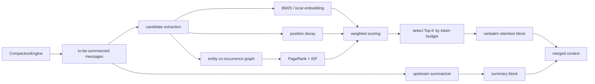

# Design and Architecture Reference

This is reference detail supporting the main [README](../README.en.md): the full content of "1. Problem and Design Trade-offs" and "2. Architecture and Data Flow" — feature-choice rationale, the scoring formula, the reasoning behind the default weights, the mermaid data-flow diagram, the core interface, and the suggested file list. The README keeps only conclusions and pointers; this document is the detail. 中文: [design.md](./design.md)

## 1. Problem and Design Trade-offs

The upstream strategy is "keep the recent tail, summarize the rest". It is adequate for short conversations, but as context pressure rises it drops precise facts that are not in the tail. Hippo only adds a switchable retention block: the summarizer still does the compression, and the retention block brings a few high-value verbatim messages back into context.

We chose locally computable features to avoid calling another LLM on every compaction:

- **Semantic relevance**: in `sim(q, m)`, `q` is the single most recent real user request in the tail. Default BM25 (with built-in IDF); set `PILOTDECK_BGE_MODEL` to switch to a local embedding cosine (`Xenova/bge-small-zh-v1.5`, runs offline, within the event's on-device model quota).
- **Position decay**: there is no reliable per-message timestamp, so decay is computed from position; it is a positional heuristic, not a true Ebbinghaus curve in real time.
- **Entity-graph coreness**: extract entities from messages, build a co-occurrence graph, run PageRank, then multiply by an IDF factor `log(1 + M / df)` to down-weight hub words that repeat across most messages. Bilingual extraction: ASCII extracts CamelCase tokens; Chinese uses a sliding-bigram, no-tokenizer extraction plus high-frequency function-word document-frequency pruning.
- **Budget constraint**: retention budget = `tailTokenBudget × 0.2`, at least 256 tokens; over-budget overflows are cut by a deterministic tie-break.

The default score (weight constants `EBBINGHAUS_DEFAULT_WEIGHTS`, re-anchored by ablation + grid search and re-checked on **unseen** seeds, see [4.2](./evaluation.en.md#42-component-ablation)):

```text
S(m) = 0.85 × sim(q, m)
     + 0.15 × position_decay(m)
     + 0.00 × idf_pagerank(m)     # weight 0; the term stays in the formula and configurable
```

The third term's default weight is **0**: on the hold-out set the rank term is **5 wins / 35 ties / 0 losses** in one-to-one comparison, **no cell significant** (p = 1 / 1 / 1 / 0.125) — dropping it costs nothing, but it also gains nothing measurable, so it takes zero weight while the code and the `wRank` config option remain, ready to enable for other distributions. These weights are a tuning result on the current synthetic protocol and cannot be taken as a global optimum for every real task; **we do not claim "weight tuning improved scores"**. Note that once the fact-marker prefix collision was fixed ([§4.10](./evaluation.en.md#410-measurement-fix-a-prefix-collision-between-fact-markers)), the tuning grid's argmax became a nine-way tie among the `wTime=0` configs (63/120) with the shipped default `0.85/0.15/0.00` at 60/120 — **that grid no longer supports "the current default is best"**. The default is nevertheless unchanged: it is the frozen shipped configuration, and the hold-out difference is inside the noise (three cells tied with `sim only`, one 0.4 apart), which does not justify a change that would invalidate every measurement. The real main effect is "verbatim retention vs no retention" ([§4.5](./evaluation.en.md#45-holdout-validation-seeds-used-for-parameter-selection-are-never-used)).

When there is no query, `sim` degenerates to the constant `0.5` and contributes nothing to ranking; under the default weights `wRank` is likewise 0, so ranking is **determined by recency alone** — which is exactly why the no-query scenario sits near the floor on every metric. So the CompactionEngine now **avoids entering that scenario** rather than weighting `rank` as a safety net: when the tail yields no user request, it falls back to the most recent real user request in the whole conversation ([§4.2](./evaluation.en.md#42-component-ablation), item 4).

## 2. Architecture and Data Flow



Core interface (matches the code):

```ts
const engine = new CompactionEngine({
  model, // your summarizer model adapter
  scorePolicy: buildEbbinghausPageRankPolicy({
    wSim: 0.85, wTime: 0.15, wRank: 0, // this is the default; wRank>0 re-enables the entity-graph term
  }),
});
const result = await engine.run({ trigger: "auto", messages, keepTailRatio: 0.18 });
```

Omitting `scorePolicy` uses the upstream path. On the app side this config parses into the same policy with no code change:

```ts
// src/context/compaction/retention/src/EbbinghausPageRankPolicy.ts
resolveRetentionScorePolicy({ retention: "hippo" }) // → EbbinghausPageRankPolicy
resolveRetentionScorePolicy({ retention: "off" })   // → undefined (pure upstream)
```

### 2.1 Carry-over: re-selecting across rounds

A long task crosses several compaction boundaries. Round 2's input is round 1's **actual output**, and a message round 1 deliberately kept verbatim gets no credit in round 2: it re-enters the "about to be summarised" set and is scored, together with everything new, against the request that is current *now*. The moment the request drifts, the text pinned one round ago can be folded back into a summary — kept, dropped, kept again.

`src/context/compaction/retention/src/CarryOver.ts` gives that batch a **capped allowance** of its own: 25% of the retention budget (`CARRYOVER_BUDGET_SHARE = 0.25`), filled best-current-score first until it is full. A message a previous round kept is stamped `metadata.hippoRetained: true` on the way out, and that is how the next round recognises it.

The trade-off that matters is that **nothing is re-ranked**. The allowance adds no bonus to any message, so the candidates' relative order is exactly what it would be with carry-over off — an old message can never outrank one the pending request actually needs. `PILOTDECK_CARRYOVER=off` (or `0` / `false` / `no` / `disabled`) turns it off in one word so the two arms can be compared directly.

The two rejected designs are recorded in the file header together with their measured numbers. A **flat score bonus** — simply adding a constant to a carried message's score — holds the oldest bracket, but a bonus large enough to do that is also large enough to outrank the message the pending request is about: it collapsed the newest bracket from 5/5 to 1.67/5 by round 3. An **oldest-first allowance** reaches the oldest bracket (2.01) but pays for it with the two newer ones (middle 0.45, newest 4.80, total 7.26 — *below* the carry-over-off arm). The shipped version, paired over 80 seeds, moves the middle bracket 1.36 → 1.80 and the total 6.38 → 6.78, while the oldest bracket goes 0.01 → 0.00 — it does **not** rescue it. That was the goal of the change; we measured that it fails, and say so. Protocol: [§4.9](./evaluation.en.md#49-long-horizon-one-task-across-several-compactions).

Suggested files to look at during review:

- `src/context/compaction/CompactionEngine.ts`: the switch, candidates, retention block, and merge order.
- `src/context/compaction/retention/src/CarryOver.ts`: cross-round re-selection — the switch, the budget share, and both rejected designs with their measured numbers in the header comment.
- `src/context/compaction/retention/src/RetentionTypes.ts`: policy and scoring types.
- `src/context/compaction/retention/src/MessageText.ts`: uniform message textification.
- `src/context/compaction/retention/src/LocalEmbedding.ts`: local embedding and BM25 fallback.
- `src/context/compaction/retention/src/EntityGraph.ts`: bilingual entity extraction, DF pruning, IDF-PageRank.
- `src/context/compaction/retention/src/EbbinghausScore.ts`, `EbbinghausPageRankPolicy.ts`: scoring and budget selection.
- `isSyntheticPseudoMessage` in `src/context/compaction/toolPairIntegrity.ts`: bookkeeping messages — snip/compact boundary markers, the continuation sentinel, anything with `metadata.synthetic` — never become retention candidates. Otherwise a single 26-token `<snip-boundary/>` marker can swallow the whole budget.
- `tests/context/hippo-retention.spec.ts`: dedicated unit tests.
- `benchmarks/`: A/B, ablation, tuning and real-LLM evaluation scripts.
