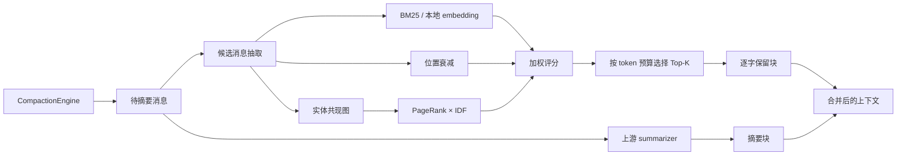

# 设计与架构参考

本文是 [README](../README.md) 的参考细节，收录「1. 问题与设计取舍」与「2. 架构与数据流」两节的完整内容：特征选择理由、评分公式、默认权重的取舍依据、mermaid 数据流图、核心接口与建议查阅的文件清单。正文只保留结论与指针，细节以本文为准。English: [design.en.md](./design.en.md)

## 1. 问题与设计取舍

上游策略可以概括为"保留最近 tail，其余内容压成摘要"。它对短对话足够有效，但在上下文压力上升时会丢掉不在 tail 中的精确事实。Hippo 只增加一个可开关的保留块：摘要仍负责压缩，保留块负责把少量高价值原文带回上下文。

我们选择本地可计算的特征，避免每次压缩再调用一个大模型：

- **语义相关性**：`sim(q, m)` 中 `q` 是尾部最近一条真实 user 请求。默认 BM25（内部自带 IDF）；设置 `PILOTDECK_BGE_MODEL` 后可切换本地 embedding cosine（`Xenova/bge-small-zh-v1.5`，可离线运行）。
- **位置衰减**：当前没有可靠消息时间戳，因此按消息位置计算衰减；它是位置启发式，不等同于真实时间上的艾宾浩斯曲线。
- **实体图核心度**：从消息抽取实体、建共现图、跑 PageRank，再乘 `log(1 + M / df)` 的 IDF，压低在多数消息重复出现的枢纽词。实体抽取双语：ASCII 抽大写驼峰记号，中文用滑动 bigram 免分词抽取 + 高频功能词文档频率剪枝。
- **预算约束**：保留块预算为 `tailTokenBudget × 0.2`，至少 256 tokens；超预算按确定性 tie-break 截断。

默认分数（权重常量 `EBBINGHAUS_DEFAULT_WEIGHTS`，由消融 + 网格搜索重锚，并在**未见 seed** 上复核，见 [4.2](./evaluation.md#42-组件消融)）：

```text
S(m) = 0.85 × sim(q, m)
     + 0.15 × position_decay(m)
     + 0.00 × idf_pagerank(m)     # 权重 0，公式项仍保留、可配置
```

第三项默认权重为 **0**：rank 项在留出集上一对一比较 **5 胜 / 35 平 / 0 负，四个格子无一显著**（p = 1 / 1 / 1 / 0.125）——去掉它不吃亏，但也没带来可测量的收益，所以不占权重，但代码与配置项保留，供其他分布启用。该权重是当前合成协议上的调参结果，不能直接视为所有真实任务的全局最优；**我们不宣称"权重优化带来了提升"**。要留意的是，修正了事实标记的前缀碰撞（[§4.10](./evaluation.md#410-测量口径修正事实标记的前缀碰撞)）之后，调参网格的 argmax 变成一组并列的 `wTime=0` 配置（63/120），当前默认 `0.85/0.15/0.00` 是 60/120——**这张网格不再支持"当前默认最优"**。默认值仍然保持不变：冻结的发布配置，且留出集上差异落在噪声内（与 `sim only` 三格打平、一格差 0.4），不足以支持一次会让全部测量作废的改动。真正的主效应是"逐字保留 vs 不做保留"（[§4.5](./evaluation.md#45-留出集验证选过参数的-seed-一律不用)）。

没有 query 时 `sim` 退化为常数 `0.5`、对排序没有贡献；此时默认权重下 `wRank` 同样是 0，于是排序**只由时近度决定**——这正是无 query 场景各项指标都接近地板的原因。所以 CompactionEngine 现在做的是**避免误入该场景**而不是给 rank 加权兜底：尾部取不到用户请求时，回退到全对话中最近的一条真实用户请求（[§4.2](./evaluation.md#42-组件消融) 第 4 条）。

## 2. 架构与数据流



核心接口（与代码一致）：

```ts
const engine = new CompactionEngine({
  model, // 你的摘要模型适配器
  scorePolicy: buildEbbinghausPageRankPolicy({
    wSim: 0.85, wTime: 0.15, wRank: 0, // 缺省即该值；wRank>0 可重新启用实体图项
  }),
});
const result = await engine.run({ trigger: "auto", messages, keepTailRatio: 0.18 });
```

不传 `scorePolicy` 时走上游路径。App 侧由配置解析成同一个策略，无需改代码：

```ts
// src/context/compaction/retention/src/EbbinghausPageRankPolicy.ts
resolveRetentionScorePolicy({ retention: "hippo" }) // → EbbinghausPageRankPolicy
resolveRetentionScorePolicy({ retention: "off" })   // → undefined（纯上游）
```

### 2.1 跨轮次再选择（carry-over）

长任务会跨过多次压缩边界。第二轮的输入是**第一轮的真实输出**，而第一轮被逐字保留的消息到了第二轮没有任何优待：它重新进入"将被摘要掉"的集合，和新来的消息一起按**当前**请求重新打分。请求一旦漂移，上一轮刚钉住的原文就可能被折进摘要——留下、丢掉、再留下，来回翻烧饼。

`src/context/compaction/retention/src/CarryOver.ts` 给这批消息一小块**封顶预算**：占保留预算的 25%（`CARRYOVER_BUDGET_SHARE = 0.25`），按当前分数从高到低填，填满即止。上一轮被保留过的消息在输出时被打上 `metadata.hippoRetained: true`，下一轮据此识别。

关键取舍是**不动排序**：这一块额度不会给任何消息加分，候选的相对顺序与不开启时完全一致，所以一条旧消息挤不掉当前问题真正需要的消息。`PILOTDECK_CARRYOVER=off`（或 `0` / `false` / `no` / `disabled`）一行关掉，两个臂可以直接对比。

两种被否掉的方案留在文件头注释里，连同实测数字：**扁平加分**（给上一轮保留过的消息直接加一个固定分数）会把最新的一个事实段从 5/5 打到 1.67/5——它抬高了旧消息，代价是当前问题要的消息被挤出去；**最旧优先配额**（老消息先占额度）在四个事实段上是 2.01 / 0.45 / 4.80 / 合计 7.26，总量反而低于关闭 carry-over 的臂。现在这版在 80 个 seed 上的配对结果是中间段 1.36 → 1.80、合计 6.38 → 6.78，而最旧段 0.01 → 0.00（**没有**救回来——那正是它想解决的问题，实测没做到，如实记录）。口径见 [§4.9](./evaluation.md#49-长程同一个任务跨多次压缩)。

建议查看以下文件（`hippo-retention` 包的源码在 `src/context/compaction/retention/src/`）：

- `src/context/compaction/CompactionEngine.ts`：接入开关、候选消息、保留块与合并顺序。
- `src/context/compaction/retention/src/CarryOver.ts`：跨轮次再选择；开关、预算份额，以及两个被否方案与其实测数字都在文件头注释里。
- `src/context/compaction/retention/src/RetentionTypes.ts`：策略与评分类型。
- `src/context/compaction/retention/src/MessageText.ts`：统一消息文本化。
- `src/context/compaction/retention/src/LocalEmbedding.ts`：本地 embedding 与 BM25 fallback。
- `src/context/compaction/retention/src/EntityGraph.ts`：中英文实体抽取、DF 剪枝、IDF-PageRank。
- `src/context/compaction/retention/src/EbbinghausScore.ts`、`EbbinghausPageRankPolicy.ts`：评分和预算选择。
- `src/context/compaction/toolPairIntegrity.ts` 的 `isSyntheticPseudoMessage`：snip/compact 边界标记、续写哨兵、`metadata.synthetic` 之类的簿记消息不进保留候选——否则一个 26-token 的 `<snip-boundary/>` 标记就能吃满整个保留预算。
- `tests/context/hippo-retention.spec.ts`：专项单测。
- `benchmarks/`：A/B、消融、调参和真 LLM 评测脚本。
